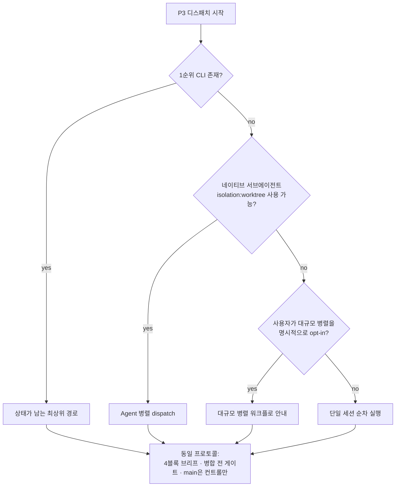

# `control-loop` 운송 부록 (26-2, D-6/Q5)

> **이 문서는 규범이 아니다.** `control-loop` 스킬의 프로토콜(4블록 브리프 · 병합 전
> 게이트 · main 병합은 컨트롤만)은 이 문서 없이도 완전히 성립한다. 여기 실린 것은
> P3(디스패치·수신·통합)에서 **자식 세션을 실제로 어떻게 띄우는가**의 운송별 최소
> 레시피일 뿐이다 — 낡거나 이 문서가 아예 없어도 스킬은 동작해야 한다(D-6).
>
> **이 문서는 배포물(`plugins/`) 밖, `docs/`에 있다.** 근거는 셋이다 — ①
> `plugins/` 안에 특정 운송 도구 이름이 등장하면 D-6의 "배포물 안 orca 0건" 불변식이
> 깨진다 ② 이 내용은 비규범이라 배포물에 실릴 이유가 없다 ③ 소비자 대부분은 여기
> 등장하는 도구를 쓰지 않으므로 배포물 크기만 늘린다. `verify-done.sh`가 `plugins/`
> 전체에서 이 도구 이름을 0건으로 강제한다(G-D6) — 이 문서에 새 레시피를 추가하더라도
> **`plugins/` 쪽 파일에는 그 이름을 옮기지 마라.**

## 감지 사다리

자식 세션을 띄울 때, 위에서부터 순서대로 시도 가능 여부를 확인하고 **먼저 맞는
것**을 쓴다. 전부 실패해도 마지막 단계(단일 세션 순차 실행)로 끝나므로 **항상
성공한다** — fail-open.



어느 단을 쓰든 규범은 하나다(`P`): **4블록 브리프 · 병합 전 게이트를 컨트롤이 직접
실행 · main 병합은 컨트롤만.** 아래 각 단은 "감지 명령"과 "최소 레시피"만 담는다 —
전체 사용법은 각 도구 자신의 문서를 본다.

---

### 1단 — 상태가 남는 최상위 오케스트레이션 CLI

여러 워크트리·자식 세션에 걸친 Run/Task/Dispatch 상태를 CLI가 스스로 추적해 주는
경로. 사용 가능하면 최우선이다 — 통지·재시도·완료 보고가 CLI 계약으로 이미
표준화돼 있어 나머지 단보다 되돌림·감사가 쉽다.

**감지 명령**

```bash
command -v orca >/dev/null 2>&1 && echo "1단 사용 가능"
```

**최소 레시피**

1. 자식 워크트리를 만든다(도구가 제공하는 워크트리/터미널 생성 명령).
2. 그 워크트리에 컨트롤 규범이 요구하는 4블록 브리프를 CLI의 "브리프 전달" 경로로
   보낸다.
3. CLI의 상태 조회/블로킹 대기 명령으로 완료 보고를 받는다 — **보고를 믿지 않고**,
   받은 뒤에는 컨트롤이 직접 게이트를 실행한다(규범 본문 P3).
4. 게이트 통과 후 컨트롤이 직접 병합하고, 병합 완료 통지는 **통합 브랜치의 최종
   SHA**로 한다(자식이 보고한 SHA는 rebase·squash로 사라질 수 있다).
5. 정리 단계에서 자식 마커(`$(git rev-parse --git-dir)/kit/child.json`)를 삭제한
   뒤 워크트리를 회수한다.

**함정**: 새 자식 워크트리가 컨트롤이 지정한 기준 커밋이 아니라 로컬 `main`(뒤처져
있을 수 있다)에서 생성될 수 있다 — 반드시 실제 커밋 해시를 브리프에 못박고, 자식이
착수 시 자기 HEAD로 검증하게 한다(D-30, 규범 본문에 편입돼 있다).

---

### 2단 — 네이티브 서브에이전트(격리 워크트리)

1단 CLI가 없을 때, 현재 호스트가 병렬 서브에이전트 디스패치와 워크트리 격리
기능을 지원하면 그것으로 대체한다.

**감지 명령/방법**

셸 명령이 아니라 **호스트 능력 질의**다 — 이번 세션에서 병렬 에이전트 디스패치
도구가 파일 수정 격리 옵션(예: worktree 격리)과 함께 제공되는지 직접 확인한다.
제공되지 않으면 3단으로 내려간다.

**최소 레시피**

1. 격리 옵션을 켜고 자식 역할의 서브에이전트를 디스패치한다 — 4블록 브리프를
   프롬프트에 통째로 담는다(별도 상태 저장소가 없으므로 브리프 자체가 유일한
   계약이다).
2. 서브에이전트의 최종 응답을 완료 보고로 받되, **응답 텍스트를 신뢰하지 않고**
   컨트롤이 직접 게이트를 실행한다.
3. 게이트 통과 후 컨트롤이 직접 병합한다.
4. 격리된 워크트리를 병합 후에만 회수한다.

**함정**: 이 경로는 상태를 저장하지 않는다 — 여러 자식을 동시에 굴리면 어느
서브에이전트가 어느 브리프를 받았는지는 **이 세션의 대화 컨텍스트**가 유일한
기록이다. 세션이 끊기면 추적이 끊긴다(1단 대비 이 경로가 짊어지는 대가).

---

### 3단 — 대규모 병렬 워크플로(사용자 opt-in)

1·2단이 감당하지 못할 규모(10개 이상의 독립 작업 등)이고, **사용자가 명시적으로
대규모 병렬 실행에 동의**했을 때만 이 단을 안내한다. 자동 트리거하지 않는다 —
비용·복잡도가 크기 때문이다.

**감지 명령/방법**

셸 명령이 아니라 **사용자 확인**이다: "이 규모는 대규모 병렬 워크플로 실행이
적합할 수 있습니다. 진행할까요?" 동의가 없으면 4단(단일 세션 순차)으로 내려간다.

**최소 레시피**

1. 사용자 동의를 받는다.
2. 각 독립 작업 단위를 4블록 브리프로 조립해 워크플로 스크립트의 작업 단위로
   넘긴다.
3. 워크플로 실행 결과(각 작업의 산출물)를 완료 보고로 받되, 역시 **신뢰하지 않고**
   컨트롤이 게이트를 직접 실행한다.
4. 게이트 통과 후 컨트롤이 직접 병합한다.

---

### 4단 — 단일 세션 순차 실행(최종 폴백)

위 세 단이 전부 불가능하거나 부적합하면 여기로 떨어진다. **자식 세션이라는
개념 자체가 없다** — 컨트롤 세션이 각 작업을 순서대로 직접 수행한다.

**감지 명령**: 없음 — 위 세 단이 전부 아니오이면 자동으로 이 단이다. 실패할 수
없는 폴백이라는 것이 이 사다리의 요점이다.

**최소 레시피**

1. 4블록 브리프를 여전히 작성한다 — 형식은 프로토콜의 일부이지 운송의 일부가
   아니다. 자기 자신에게 브리프를 쓰는 것이 어색해 보여도, 범위·금지사항·완료
   조건을 명문화하는 효과는 동일하다.
2. 작업을 직접 수행한다.
3. 게이트를 직접 실행한다 — "보고를 믿지 않는다"가 여기서는 "스스로를 점검한다"로
   치환될 뿐 생략되지 않는다.
4. 게이트 통과 후 병합(이미 같은 브랜치에 있다면 이 단계는 자명하다).

---

## 파리티 · 하네스 범위

이 사다리의 1·3단에 등장하는 도구는 **모두 Claude Code CLI 세션에서만** 의미가
있다. Codex·Antigravity 등 다른 하네스에서 `control-loop`을 쓰면 2단(해당 호스트가
병렬 서브에이전트+격리를 지원하는 경우)까지만 성립할 수 있고, 그마저 없으면 곧장
4단(단일 세션 순차)로 fail-open한다 — 이것이 정확히 파리티 계약이 예측하는
동작이다: 규범과 절차(L0·L1)는 모든 하네스 공통이고, 전용 실행자·자동 강제
(L2·L3)는 Claude Code 심화 기능이다.

## 관련

- `control-loop` 스킬 본문 — 이 부록이 설명하는 프로토콜의 SSOT.
- `plugins/common/hooks/examples/README.md` — 자식 세션 git 안전장치(opt-in 훅)의
  마커 규격·한계.
