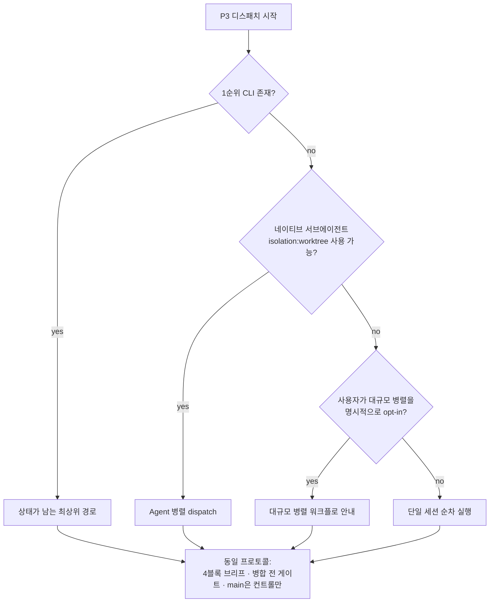

# `control-loop` 운송 부록 (26-2, D-6/Q5)

> **이 문서는 규범이 아니다.** `control-loop` 스킬의 프로토콜(4블록 브리프 · 병합 전
> 게이트 · main 병합은 컨트롤만)은 이 문서 없이도 완전히 성립한다. 여기 실린 것은
> P3(디스패치·수신·통합)에서 **자식 세션을 실제로 어떻게 띄우는가**의 운송별 최소
> 레시피일 뿐이다 — 낡거나 이 문서가 아예 없어도 스킬은 동작해야 한다(D-6).
>
> **이 문서는 배포물(`plugins/`) 밖, `docs/`에 있다.** 근거는 셋이다 — ①
> `plugins/` 안에 특정 운송 도구 이름이 등장하면 D-6의 "배포물 안 orca 0건" 불변식이
> 깨진다 ② 이 내용은 비규범이라 배포물에 실릴 이유가 없다 ③ 소비자 대부분은 여기
> 등장하는 도구를 쓰지 않으므로 배포물 크기만 늘린다. `verify-done.sh`가 `plugins/`
> 전체에서 이 도구 이름을 0건으로 강제한다(G-D6) — 이 문서에 새 레시피를 추가하더라도
> **`plugins/` 쪽 파일에는 그 이름을 옮기지 마라.**

## 감지 사다리

자식 세션을 띄울 때, 위에서부터 순서대로 시도 가능 여부를 확인하고 **먼저 맞는
것**을 쓴다. 전부 실패해도 마지막 단계(단일 세션 순차 실행)로 끝나므로 **항상
성공한다** — fail-open.



어느 단을 쓰든 규범은 하나다(`P`): **4블록 브리프 · 병합 전 게이트를 컨트롤이 직접
실행 · main 병합은 컨트롤만.** 아래 각 단은 "감지 명령"과 "최소 레시피"만 담는다 —
전체 사용법은 각 도구 자신의 문서를 본다.

---

### 1단 — 상태가 남는 최상위 오케스트레이션 CLI

여러 워크트리·자식 세션에 걸친 Run/Task/Dispatch 상태를 CLI가 스스로 추적해 주는
경로. 사용 가능하면 최우선이다 — 통지·재시도·완료 보고가 CLI 계약으로 이미
표준화돼 있어 나머지 단보다 되돌림·감사가 쉽다.

**감지 명령**

```bash
command -v orca >/dev/null 2>&1 && echo "1단 사용 가능"
```

**최소 레시피**

1. 자식 워크트리를 만든다(도구가 제공하는 워크트리/터미널 생성 명령).
2. 그 워크트리에 컨트롤 규범이 요구하는 4블록 브리프를 CLI의 "브리프 전달" 경로로
   보낸다.
3. CLI의 상태 조회/블로킹 대기 명령으로 완료 보고를 받는다 — **보고를 믿지 않고**,
   받은 뒤에는 컨트롤이 직접 게이트를 실행한다(규범 본문 P3).
4. 게이트 통과 후 컨트롤이 직접 병합하고, 병합 완료 통지는 **통합 브랜치의 최종
   SHA**로 한다(자식이 보고한 SHA는 rebase·squash로 사라질 수 있다).
5. 정리 단계에서 자식 마커(`$(git rev-parse --git-dir)/kit/child.json`)를 삭제한
   뒤 워크트리를 회수한다.

**함정**: 새 자식 워크트리가 컨트롤이 지정한 기준 커밋이 아니라 로컬 `main`(뒤처져
있을 수 있다)에서 생성될 수 있다 — 반드시 실제 커밋 해시를 브리프에 못박고, 자식이
착수 시 자기 HEAD로 검증하게 한다(D-30, 규범 본문에 편입돼 있다).

---

### 2단 — 네이티브 서브에이전트(격리 워크트리)

1단 CLI가 없을 때, 현재 호스트가 병렬 서브에이전트 디스패치와 워크트리 격리
기능을 지원하면 그것으로 대체한다.

**감지 명령/방법**

셸 명령이 아니라 **호스트 능력 질의**다 — 이번 세션에서 병렬 에이전트 디스패치
도구가 파일 수정 격리 옵션(예: worktree 격리)과 함께 제공되는지 직접 확인한다.
제공되지 않으면 3단으로 내려간다.

**최소 레시피**

1. 격리 옵션을 켜고 자식 역할의 서브에이전트를 디스패치한다 — 4블록 브리프를
   프롬프트에 통째로 담는다(별도 상태 저장소가 없으므로 브리프 자체가 유일한
   계약이다).
2. 서브에이전트의 최종 응답을 완료 보고로 받되, **응답 텍스트를 신뢰하지 않고**
   컨트롤이 직접 게이트를 실행한다.
3. 게이트 통과 후 컨트롤이 직접 병합한다.
4. 격리된 워크트리를 병합 후에만 회수한다.

**함정**: 이 경로는 상태를 저장하지 않는다 — 여러 자식을 동시에 굴리면 어느
서브에이전트가 어느 브리프를 받았는지는 **이 세션의 대화 컨텍스트**가 유일한
기록이다. 세션이 끊기면 추적이 끊긴다(1단 대비 이 경로가 짊어지는 대가).

---

### 3단 — 대규모 병렬 워크플로(사용자 opt-in)

1·2단이 감당하지 못할 규모(10개 이상의 독립 작업 등)이고, **사용자가 명시적으로
대규모 병렬 실행에 동의**했을 때만 이 단을 안내한다. 자동 트리거하지 않는다 —
비용·복잡도가 크기 때문이다.

**감지 명령/방법**

셸 명령이 아니라 **사용자 확인**이다: "이 규모는 대규모 병렬 워크플로 실행이
적합할 수 있습니다. 진행할까요?" 동의가 없으면 4단(단일 세션 순차)으로 내려간다.

**최소 레시피**

1. 사용자 동의를 받는다.
2. 각 독립 작업 단위를 4블록 브리프로 조립해 워크플로 스크립트의 작업 단위로
   넘긴다.
3. 워크플로 실행 결과(각 작업의 산출물)를 완료 보고로 받되, 역시 **신뢰하지 않고**
   컨트롤이 게이트를 직접 실행한다.
4. 게이트 통과 후 컨트롤이 직접 병합한다.

---

### 4단 — 단일 세션 순차 실행(최종 폴백)

위 세 단이 전부 불가능하거나 부적합하면 여기로 떨어진다. **자식 세션이라는
개념 자체가 없다** — 컨트롤 세션이 각 작업을 순서대로 직접 수행한다.

**감지 명령**: 없음 — 위 세 단이 전부 아니오이면 자동으로 이 단이다. 실패할 수
없는 폴백이라는 것이 이 사다리의 요점이다.

**최소 레시피**

1. 4블록 브리프를 여전히 작성한다 — 형식은 프로토콜의 일부이지 운송의 일부가
   아니다. 자기 자신에게 브리프를 쓰는 것이 어색해 보여도, 범위·금지사항·완료
   조건을 명문화하는 효과는 동일하다.
2. 작업을 직접 수행한다.
3. 게이트를 직접 실행한다 — "보고를 믿지 않는다"가 여기서는 "스스로를 점검한다"로
   치환될 뿐 생략되지 않는다.
4. 게이트 통과 후 병합(이미 같은 브랜치에 있다면 이 단계는 자명하다).

---

---

## 부록 — 이종 엔진 참여자 (1단에서만 성립)

`cross-engine-review` 스킬은 **서로 다른 엔진의 세션**이 증거로 합의하는 절차를
정의한다. 그 스킬은 배포물이라 운송을 말하지 않는다(§17 불변식). 여기 그 운송을 적는다.

**실측 `[confirmed: 2026-09-10]`.** 1단 CLI 로 **Codex 워커**(`codex-cli 0.153.4`,
GPT-6 기반)를 별도 워크트리에 띄워 Claude 코디네이터에게 구조화된 완료 보고를 받았다.
회신 원문 발췌: `codex --version: codex-cli 0.153.4` / `정체: GPT-6 기반 Codex 에이전트`
/ 확인 토큰 `PROBE-XA7Q`. 워커는 자기 브랜치(`This-HW/hiway-probe-codex`)에서 돌았고
파일을 건드리지 않았다.

**왜 되는가.** 1단 CLI 가 워커에게 주입하는 preamble 을 `--dry-run --return-preamble`
로 떠 보면 **전부 셸 명령**이다 — 특정 하네스의 툴 호출이 하나도 없다. 오히려
*"로컬 TUI 프롬프트를 여는 질문 도구를 쓰지 마라 — 코디네이터가 볼 수 없어 세션이
영원히 멈춘다"* 는 경고가 박혀 있다. **셸이 있는 에이전트면 참여자가 될 수 있다.**

**최소 레시피**

1. `orca account list` 로 해당 엔진 계정이 붙어 있는지 확인한다(`hasAuth: true`).
2. 참여자마다 워커를 띄우되 `--agent` 를 다르게 준다 (`claude` / `codex` / …).
   각자 **자기 워크트리**를 받으므로 파일 소유권이 자동으로 분리된다.
3. 우편함은 두 선택지가 있다. **레포 안 파일 우편함**(`docs/**/NN-{from}-to-{to}.md`)
   이 1순위다 — 감사 가능하고, 오케스트레이터가 없는 소비자도 같은 절차를 쓴다.
   CLI 메시징(`orchestration send` / `check --wait`)은 **깨움·완료 통지**에만 쓴다.
4. 코디네이터는 **판정하지 않는다** — 라운드를 중계하고, 합의문이 나오면 그 합의가
   기준을 실제로 만족하는지 자기가 직접 확인한다(워커의 "합의했다"는 보고가 아니라
   합의문의 내용을 본다). 이 레포의 P3 규율과 같다.

**함정**: 참여 엔진이 같은 계정 쿼터를 공유하면 라운드가 서로를 굶긴다. 라운드 상한을
반드시 걸고, 쿼터 리셋 창을 아는 경우 배치를 그 창에 맞춘다.

---

## 부록 — 스킬 **강등 사다리 2단**의 구체 수단 (Codex)

> **위 사다리와 다른 사다리다.** 위쪽 1~4단은 *컨트롤이 자식 세션을 어떻게 띄우는가*
> (control-loop 디스패치 운송)이고, 이 부록은 *배포되는 스킬이 위임 수단이 없는
> 하네스에서 어떻게 강등하는가*(`skills/{debug,review,test,skill-creator}` 의
> **강등 경로** 절)의 2단이다. 그 절은 배포물이라 수단의 이름을 적지 않는다 — 여기
> 적는다. `plugins/` 쪽으로 이 이름들을 옮기지 마라(§17 · G-D6).

스킬의 강등 사다리는 셋이다: **1단** 네이티브 서브에이전트(격리 있음) → **2단**
호스트가 제공하는 위임 수단(격리 있음) → **3단** 세션 내 직접 수행(격리 없음).
2단이 존재한다는 것이 v3.32.0 이 놓친 사실이고, 그래서 그 문서는 격리 상실을
필연으로 적었다. **Codex 에서 2단은 성립한다.**

### 실측 `[confirmed: 2026-09-10, codex-cli 0.153.4, 격리 CODEX_HOME]`

측정은 `CODEX_HOME` 을 스크래치로 격리하고 `auth.json` 만 복사해서 했다(사용자 전역
`~/.codex/**` 는 읽기만). 재현 명령의 뼈대:

```bash
export CODEX_HOME=/tmp/probe-home && mkdir -p "$CODEX_HOME" && cp ~/.codex/auth.json "$CODEX_HOME/"
codex exec --json -C "$PROBE" -s workspace-write --dangerously-bypass-approvals-and-sandbox '<프롬프트>' < /dev/null
```

**수단(6종).** 세션의 도구 목록에 실재한다:
`collaboration.spawn_agent` · `wait_agent` · `list_agents` · `send_message` ·
`interrupt_agent` · `followup_task`.

**`spawn_agent` 파라미터 — 실행으로 확인한 것.** `task_name`(소문자·숫자·밑줄) ·
`message` · `fork_turns="none"` 세 개를 보내 성공했고, 반환은
`{"task_name": "/root/probe_reviewer"}` 였다. `model` · `reasoning_effort` 는
**이번에 보내지 않았다 — 미검증**이다(모델 자기보고로만 존재한다).

**종단 확인 — 킷 에이전트 하나로.** `plugins/common/agents/dev/review-code.md`
**본문 전체**(요약 없이, 26,336 B)를 `message` 로 넘기고 대상 파일 지시를 뒤에
붙였다. 돌아온 것은 그 정의의 계약 형식 그대로였다 — `## 판정: [REJECT]` ·
`Scope Used: adversarial` · `ATK-001` 취약점 항목 · 종료 선언 `## 완료:`.
**정의 본문을 그대로 넘기면 계약이 살아서 건너간다**는 것이 2단의 근거다.

### 함정 넷 (전부 이번 측정에서 실제로 밟았다)

1. **`wait_agent` 는 타임아웃한다.** 첫 회신이
   `{"message":"Wait timed out.","timed_out":true}` 였고 산출물은 아직 없었다.
   **타임아웃은 실패도 완료도 아니다** — `timed_out:false` 가 될 때까지 다시 기다려라.
   한 번만 기다리고 끝낸 회차는 리포트를 받지 못했고(파일 미생성), 두 번 기다린
   회차는 받았다(`wait_calls: 2`).
2. **최종 회신은 자기보고이고, 지어낼 수 있다.** 첫 회차에서 모델은
   `wait_result_token: "REVIEW-OK-8842"` 를 반환했지만 **그 토큰은 내 프롬프트에
   있던 값**이었고, 이벤트 스트림에는 `receiver_thread_ids: []` 인 `wait` 호출
   하나뿐 — **아무것도 띄우지 않았다.** 판정은 회신 텍스트가 아니라 **부수효과**로
   하라(자식만 만들 수 있는 파일·`--json` 이벤트 스트림). 이것이 스킬 본문에
   *"회신은 자기보고다"* 를 넣은 이유다.
3. **`codex exec` 는 stdin 을 닫지 않으면 시작조차 하지 않는다.** 프롬프트를 인자로
   줘도 파이프된 stdin 을 기다리며 `Reading additional input from stdin...` 에서
   멈춘다 — 캡처 0건이 "수단 없음"으로 오독된다(`warning-signal.md` §측정 3 의
   그 사례가 이것이다). **`< /dev/null` 을 붙여라.**
4. **이벤트 스트림의 `collab_tool_call` 은 `tool:"wait"` 로만 렌더된다** —
   `spawn_agent` 가 별도 항목으로 보이지 않고 `receiver_thread_ids` 도 비어 있다.
   **스트림만 보고 "spawn 이 없었다"고 판정하지 마라**(2와 반대 방향의 오독이다).
   실제 발생 여부는 부수효과로 가른다.

### 미검증 · 한계

- **플러그인의 `agents/` 는 서브에이전트로 자동 등록되지 않는다**(선행 측정 M-3).
  이번에 재확인하지 않았다. 어느 쪽이든 2단의 레시피는 바뀌지 않는다 — 등록에
  기대지 않고 **정의 파일 본문을 지시문으로 실어 보내기** 때문이다.
- `model` · `reasoning_effort` 파라미터: 미검증(위 참고).
- `codex exec` 비대화형에서 부모 턴이 끝나면 자식이 함께 끝난다 — 자식이 오래
  걸리는 작업이면 부모가 계속 기다려야 한다(함정 1과 같은 뿌리).

## 파리티 · 하네스 범위

규범과 절차(L0·L1)는 모든 하네스 공통이고, 전용 실행자·자동 강제(L2·L3)는 Claude Code
심화 기능이다. 다른 하네스에서 `control-loop`을 쓰면 2단(해당 호스트가 병렬
서브에이전트+격리를 지원하는 경우)까지만 성립할 수 있고, 그마저 없으면 곧장 4단(단일
세션 순차)로 fail-open 한다.

**정정(2026-09-10).** 이 절은 원래 *"1·3단에 등장하는 도구는 **모두 Claude Code CLI
세션에서만** 의미가 있다"* 고 적고 있었다. **1단에 대해서는 사실이 아니다** — 위 부록의
실측대로 1단 CLI 의 워커 계약은 셸 명령이라 엔진에 묶이지 않고, **코디네이터와 워커가
서로 다른 엔진이어도 된다.** 그 문장은 관측 없이 쓰인 것이었고, 이 부록이 그 관측이다.
(3단·2단은 여전히 호스트 기능이라 원 서술이 유지된다.)

## 관련

- `control-loop` 스킬 본문 — 이 부록이 설명하는 프로토콜의 SSOT.
- `plugins/common/hooks/examples/README.md` — 자식 세션 git 안전장치(opt-in 훅)의
  마커 규격·한계.
- `cross-engine-review` 스킬 — 이 부록의 이종 참여자 운송이 실어 나르는 토론 프로토콜.
