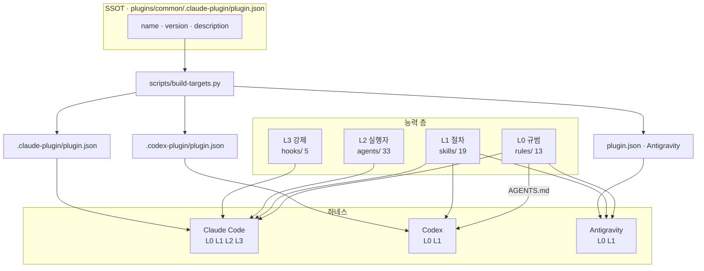
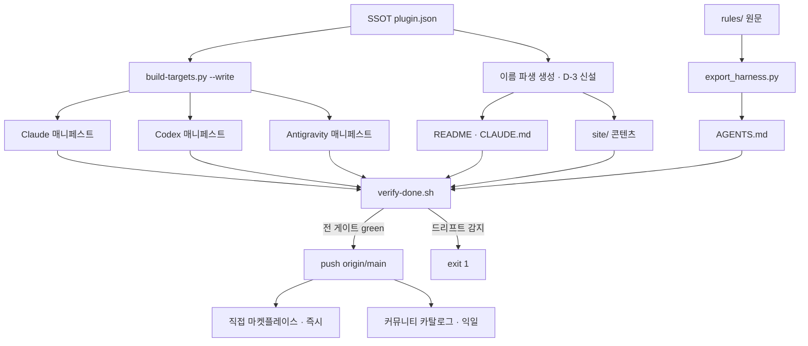
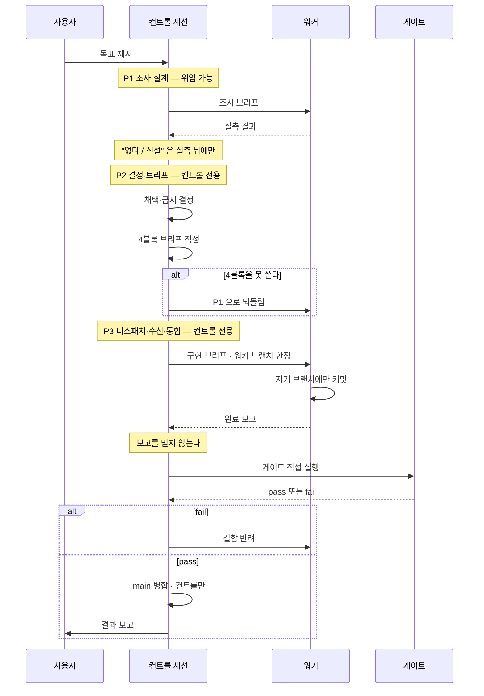
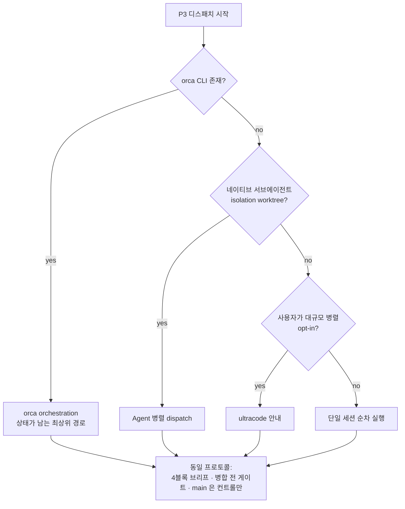
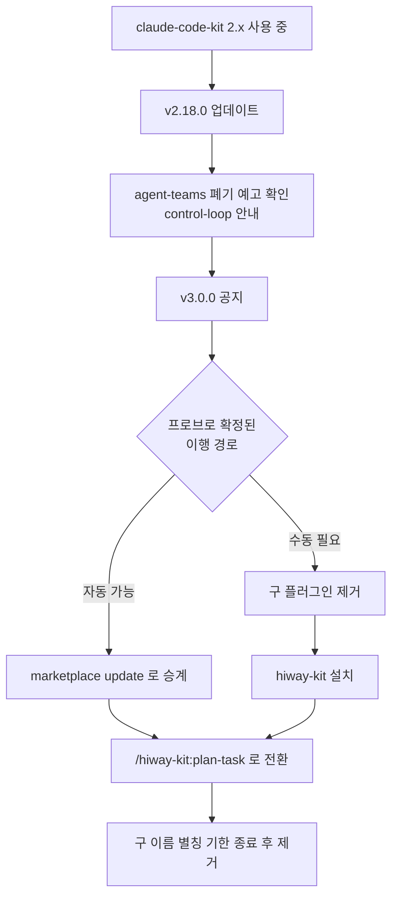
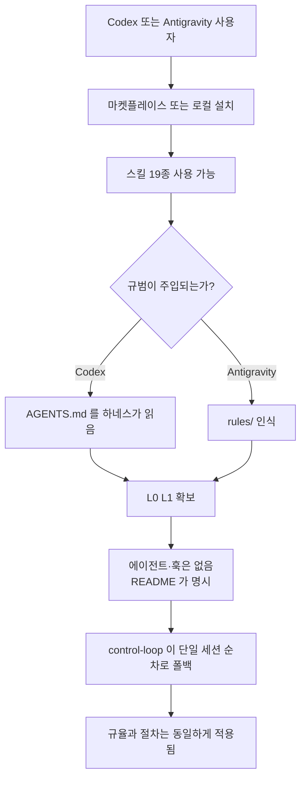
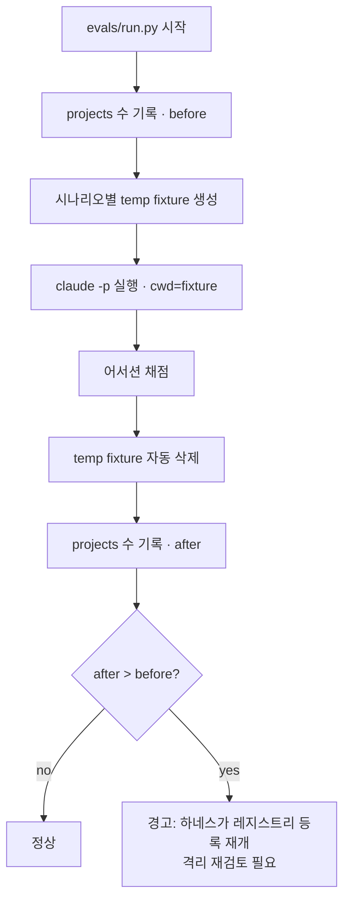
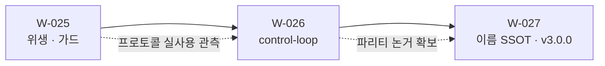

# 하이웨이 프로그램 설계 — 하네스 중립 전환 (W-025 ~ W-027)

> 상태: **설계 최종본**. 구현 전. 이 문서가 세 배치의 SSOT다.
> 작성: 2026-09-07 / 컨트롤 세션 `This-HW/planning-control-session` @ 086b2ae
> 선행 브리프: 세션 내 아티팩트 "하이웨이 전환 브리프" (본 문서가 그것을 대체·정정한다)

---

## 0. 목표와 판단 기준

**목표.** 킷을 "Claude Code 전용 플러그인"에서 "하네스 중립 에이전트 규율 킷"으로 옮기되,
**이름이 약속하는 것과 실제로 이식되는 것이 어긋나지 않게** 한다.

**판단 기준(모든 결정에 동일 적용).**

1. **약속과 실물의 일치** — 문서·이름·매니페스트가 주장하는 것은 실측으로 뒷받침돼야 한다.
   이 레포가 반복해서 잡아온 결함은 전부 "켜져 있다는 착각" 계열이다.
2. **부채 없음** — 같은 질문에 답하는 컴포넌트를 둘 두지 않는다. 생성물은 SSOT에서 파생한다.
3. **소비자 우선** — 설치하는 사람의 환경에서 동작해야 한다. 특정 플러그인·MCP·CLI의 존재를 가정하지 않는다.

---

## 1. 관측 — 실측 근거

### 1.1 하네스별 실제 이식 범위

| 컴포넌트 | 개수 | Claude Code | Codex | Antigravity |
| --- | ---: | --- | --- | --- |
| skills | 19 | 전부 | 전부 | 전부 |
| rules | 13 | 세션 주입 | `AGENTS.md` 경유 | 인식 |
| agents | 33 | 전부 | 전용 필드 없음 | **0종 인식** |
| hooks | 5 | 전부 | 의미 없음 | 싣지 않음 |

근거는 새로 만든 것이 아니라 `packaging/targets.json` 에 이미 실측 기록으로 있다 —
`agy` 는 `agents/` 를 재귀하지 않아 카테고리 디렉토리 4개를 "에이전트 4개"로 오등록하고
실제 33개는 하나도 읽지 못한다. Codex 훅은 형식 변환은 되지만 킷의 훅 5개가 전부 Claude Code
이벤트 모델(`hookSpecificOutput.additionalContext`, `tool_name` 매처, `decision:block`)에
묶여 있어 실행돼도 제어 효과가 없다.

### 1.2 지금 어디에도 설치돼 있지 않다

```
$ find ~/.codex/plugins -maxdepth 3 -type d   → openai-curated-remote 뿐. kit 없음
$ ls ~/.antigravity/extensions/               → VS Code 확장뿐. kit 없음
```

다중 하네스 지원은 **생성 + 1회 실측 검증**까지고 상시 사용이 아니다. 즉 현재의 "3사 공통"은
**매니페스트 수준의 주장**이다.

### 1.3 이름이 SSOT에서 파생되지 않는다

`git grep -l "claude-code-kit"` → **59개 파일**. `build-targets.py` 가 매니페스트 3종을
SSOT에서 생성하는 규율을 세워뒀는데, 문서·사이트·스킬 본문의 이름은 그 규율 밖이다.
**개명 비용이 파일 수에 비례한다는 것 자체가 부채다.**

### 1.4 정정 — eval 레지스트리 오염은 현행 결함이 **아니다**

선행 브리프는 `~/.claude.json` 의 유령 프로젝트 26건을 "eval 러너가 지금도 오염시킨다"고
적었다. **대조 실험으로 반증됐다.**

| 실험 | 명령 | projects 델타 |
| --- | --- | ---: |
| 대조군 | 임시 디렉토리에서 `claude -p` | **0** |
| 실제 eval 형태 | `-p` + `--append-system-prompt` + `--permission-mode bypassPermissions` + `--allowedTools` | **0** |
| 격리 실험 | `CLAUDE_CONFIG_DIR=<tmp>` | 0 (격리 자체는 동작 — 전용 `.claude.json`·`projects/`·`sessions/` 생성) |

`evals/run.py:1134` 의 `tempfile.TemporaryDirectory(prefix="ckkit-eval-…")` 와
`subprocess.run(cmd, cwd=str(work_dir))` 는 사실이지만, **현행 Claude Code 2.1.263 은
`-p` 세션의 cwd 를 전역 레지스트리에 등록하지 않는다.** 유령 26건은 과거 버전의 잔재다.

> 부수 관측: `CLAUDE_CONFIG_DIR` 로 config dir 를 격리하면 **인증이 따라가지 않는다**
> ("Not logged in"). 키체인 항목(`svce="Claude Code-credentials"`)은 config dir 로
> 스코프되지 않는데도 그렇고, `oauthAccount`·`userID`·`hasCompletedOnboarding` 를
> 시드해도 해소되지 않았다. **따라서 격리는 채택하지 않는다** — 동작하지 않는 격리를
> 넣는 것이 오염보다 나쁘다.

**설계에 미치는 영향**: W-025 에서 "러너 수정"은 빠진다. 남는 것은 ① 일회성 청소와
② 회귀 가드다.

### 1.5 로컬 위생

- **처리 완료** — `~/.claude/mcp-disabled-stash.json` 삭제. 평문 API 키 2건(gemini·magic)이
  3개월간 방치돼 있었다. 사용자가 미사용 확인. **발급처 폐기는 사용자 몫으로 남아 있다.**
- 잔재: 고아 임시 클론 4개 + `cck-probe-marketplace`(W-019 프로브) + 킷 구버전 캐시 2개 ≈ 5.2MB
- 유령 플러그인 설치 기록 8건 (삭제된 워크트리 7 + `all-note` 1)
- 설정 백업 4개 (`settings.json.bak`, `config.toml.bak`, `.backup-20260828-llama-local`, `.bak-D368`)
- `settings.json` 33KB 중 79% 가 orca 훅 shim 12벌 반복 — **orca 소유, 손대지 않는다**
- `permissions.allow` 42개가 `skipDangerousModePermissionPrompt: true` + bypass 상시 운영과 공존
- 정상 확인: 전역 `CLAUDE.md` 226B(graphify 하나), `~/.claude/agents/`·`commands/` 비어 있음 — 이중 로드 없음

---

## 2. 결정

### D-1 — 이름은 하나다. dual-name 을 채택하지 않는다

사용자 제안: *"Claude 쪽은 `claude-code-kit` 로 두고 업데이트분만 `hiway-kit` 으로 추가"*.
**반려한다.** 근거:

- **기능 충돌** — Claude Code 사용자가 둘 다 설치하면 같은 19개 스킬·33개 에이전트가
  두 네임스페이스로 **중복 등록**된다. 이름 충돌이지 미관 문제가 아니다.
- **불변식 파괴** — `packaging/targets.json` 의 `source._meta.authority` 는
  *"name·version·… 의 SSOT는 이 매니페스트다. 어떤 타겟 생성물도 이 값을 재정의하지 않는다"* 다.
  타겟별로 다른 이름을 쓰면 이 불변식이 깨지고, **네 번째 드리프트 게이트**가 필요해진다 —
  이 레포는 그 통합을 명시적으로 거부해 뒀다.
- **부채 형태** — 일회성 이행 비용을 피하려고 **영구 분기**를 만드는 거래다. 릴리스·문서·이슈가
  전부 두 갈래가 된다.

사용자의 실제 관심사(**기존 설치를 깨지 않는 것**)는 분기가 아니라 **기한 있는 폐기 별칭**으로
푼다 → D-4.

### D-2 — 파리티 계약: 4층 + 폴백 사다리

세 하네스에 무엇을 약속할지 확정한다. 최소공통분모로 깎으면(스킬만 남기면) Claude Code 에서의
가치가 붕괴하고, 전부 이식하려 하면 플랫폼이 막는다. **층으로 나누고, 각 층이 위층으로
degrade 되게 한다.**

| 층 | 내용 | 도달 범위 | 없을 때의 폴백 |
| --- | --- | --- | --- |
| **L0 규범** | `rules/` 13 | 전 하네스 (CC=주입, 그 외=`AGENTS.md`) | — (최종 폴백) |
| **L1 절차** | `skills/` 19 | 전 하네스 | L0 규범이 문장으로 남는다 |
| **L2 실행자** | `agents/` 33 | Claude Code | L1 스킬이 단일 세션 순차로 수행 |
| **L3 강제** | `hooks/` 5 | Claude Code | L0 규범이 약한 강제로 남는다 |

**약속 문장(README·매니페스트가 같은 말을 해야 한다):**

> 규범과 절차(L0·L1)는 모든 하네스 공통. 전용 실행자와 자동 강제(L2·L3)는 Claude Code 심화 기능.

이 계약이 정직한 이유: 폴백 사다리가 있어 **L2·L3 가 없어도 킷이 무의미해지지 않는다.**
Codex 사용자는 규율과 절차를 얻고, 자동화만 잃는다.

### D-3 — 이름을 SSOT에서 파생시킨다 (개명의 선행 과제)

`build-targets.py` 가 매니페스트에 하는 일을 문서·사이트에도 적용한다. 개명 비용을
**파일 수 비례 → 상수**로 바꾼다. 이것이 없으면 v3.0.0 개명은 59파일 수작업이고,
다음 개명도 같은 값을 다시 낸다.

- 적용 대상: `README.md`, `plugins/common/README.md`, `site/` 콘텐츠, `CLAUDE.md`, 스킬 본문
- 방식: SSOT(`plugin.json` 의 `name`)에서 파생하는 생성 단계 + `verify-done.sh` 드리프트 검사
- **주의**: 이것이 § 드리프트 게이트 **네 번째**가 된다. 레포 규약상 *"네 번째가 필요해지는
  시점에 재검토"* 하기로 돼 있으므로, W-027 에서 기존 셋(§11·§13·§14)과 **묶을지 판단**한다.
  묶지 않기로 결론 나면 그 근거를 CLAUDE.md 에 기록한다.

### D-4 — 개명은 v3.0.0 한 번. 이행 경로는 실측 후 확정

- 새 이름: **`hiway-kit`**. 네임스페이스 프리픽스가 사용자 타이핑 표면이므로 18자 → 9자가
  실질 이득이다(`/claude-code-kit:plan-task` → `/hiway-kit:plan-task`). `hw` 는 하드웨어와
  충돌해 탈락, `hiway-code-kit` 은 이득이 절반.
- **이행 메커니즘은 지금 확정하지 않는다.** 마켓플레이스 항목 이름과 `plugin.json` 의 `name`
  이 불일치할 때 설치가 성립하는지 확인되지 않았다. 이 레포의 기준(`runtime-verified`)에
  미달하므로, **스크래치 마켓플레이스 프로브로 실측한 뒤** 확정한다 — W-019 의
  `cck-probe-marketplace` 와 동일 기법(그 잔재가 지금 캐시에 남아 있다).
- 프로브가 답해야 할 질문: ① 구 이름 항목을 폐기 표시로 남긴 채 신 이름으로 설치가 되는가
  ② 구 이름 설치본과 신 이름 설치본이 공존할 때 스킬·에이전트가 중복 등록되는가
  ③ `enabledPlugins` 키 이행이 자동인가 수동인가
- 커뮤니티 카탈로그는 **이름 변경 = 새 리스팅**이다(버전 갱신과 달리 재제출 필요).

### D-5 — 컨트롤 스킬은 하나, 3페이즈

축은 *기획 대 컨트롤*이 아니라 **결정 대 조사**다. 판별식은 이미 있다 —
*"브리프에 IN/OUT·수용 기준·금지 목록을 4블록으로 쓸 수 있으면 워커"*.
이 테스트를 설계 작업에 대면 설계는 통째로 한쪽에 가지 않고 **쪼개진다**: 설계에 필요한
*조사*는 4블록으로 쓸 수 있어 위임 가능하고, *결정*은 4블록을 **쓰는 행위 자체**라 위임 불가.

따라서 스킬을 기획용·컨트롤용으로 나누지 **않는다**. 나누면 결정과 브리프 작성 사이에
이음매가 생기는데, 그 이음매가 관측된 실패 지점이다 — 올림포스 운영에서 **컨트롤이 전제를
추측해 쓴 브리프가 하루 4건 워커에게 반려**됐다.

**스킬명: `control-loop`.** 레포에 이미 있는 `rules/loop-engineering.md` 어휘와 맞는다.

### D-6 — 운송(transport)은 규범이 아니라 부록이다

`orca` 는 배포물(`plugins/`) 안에 0건이다. 우연이 아니라 소비자 우선 원칙의 결과다.
`control-loop` 의 **규범 본문은 운송을 모른다** — 프로토콜(역할 경계·4블록 계약·검증·통합)만
소유한다. 운송별 실행 레시피는 **비규범 부록**으로 분리하고, 각 항목은 감지 명령 + 최소 레시피만
담는다. 부록이 낡아도 스킬은 계속 동작한다. (`rules/` ↔ `docs/architecture/rules/` 의 정본-해설
분리와 같은 층 나눔.)

### D-7 — `agent-teams` 는 흡수 후 폐기 (기한 있는 2단계)

`agent-teams` 는 현재 "대규모는 `ultracode` 로 가라"는 라우팅 안내뿐이고, 그것은
`control-loop` 부록의 한 운송 항목이다. 같은 질문에 답하는 스킬 둘을 남기지 않는다.

1. **v2.19.0** — `control-loop` 신설. *(초안은 v2.18.0 이었다. W-025 C 트랙이 2.18.0 을 쓰므로 §11.2(f) 에서 이동)* `agent-teams` 본문을 폐기 예고로 교체(내용은 흡수됨,
   `control-loop` 를 가리킴). 스킬 수 19 유지.
2. **v3.0.0** — `agent-teams` 제거. 스킬 수 19 → 18. `check_doc_counts.py` 대상 문서 전부 갱신.

메이저에서 제거하는 이유: 스킬 삭제는 `/agent-teams` 를 치던 사용자에게 파괴적 변경이다.

### D-8 — `control-loop` 의 eval 은 C등급으로 **명시 등재**한다

`evals/` 의 시나리오 29종은 전부 *에이전트 한 종의 단일 출력*을 채점한다. `control-loop` 는
여러 턴에 걸친 세션 행동이라 이 러너로 채점할 수 없다.

**침묵하지 않는다.** `evals/policy.json` 의 `tiers._tier2Classification` 에 등급 `C` + 사유 +
승격 조건과 함께 등재한다. W-024 가 신설한 `check_classification_complete` 가 이 누락을
위 문장은 **§12.3 이 반증했다** — 그 검사는 에이전트만 스캔하므로 스킬인 `control-loop` 은 영원히 걸리지 않는다. **D-8 의 강제 기전 주장은 §12.3 으로 대체됐다.**

> 이것이 `consensus-builder` 사고(분류엔 있는데 시나리오가 없어 조용히 통과)의 재발 방지다.
> 다른 점: 그때는 A등급이라 시나리오가 **있어야 했고**, 지금은 C등급이라 **없는 것이 정답**이며
> 그 사실이 기록된다.

### D-9 — 4블록 브리프는 기계 게이트를 두지 않는다 (의도적)

W-021/022 가 폐기한 `---DELEGATION_SIGNAL---` 과 겉모습이 비슷하므로 차이를 명시한다.

| | 폐기된 신호 블록 | 4블록 브리프 |
| --- | --- | --- |
| 소비자 | **없음** — 파싱하는 코드가 어디에도 없었다 | **워커 에이전트** — 실제로 읽고 그대로 수행한다 |
| 누락 시 | 아무 일도 안 일어남 (조용한 무효화) | 워커가 완료 조건을 몰라 **에스컬레이션한다** |
| 강제 방식 | 자연어 지시 → 모델 판단 | 소비 지점에서 자연 발생 |

**소비자가 있는 계약은 게이트 없이도 산다.** 없던 것이 폐기된 이유였다.

### D-10 — eval 잔재는 청소하되, 회귀 가드를 남긴다

§1.4 로 러너 수정은 불필요해졌다. 그러나 26건이 **몇 달간 아무도 모르게** 쌓였다는 사실은
남는다 — *"검사 대상이 아닌 것은 결코 red 가 되지 않는다"*.

- 일회성: 유령 프로젝트 항목 28건 정리
- 가드: 러너가 **전체 실행 전후의 `~/.claude.json` projects 수를 비교**해 증가 시 경고.
  추가 API 비용 0, 코드 ~10줄. 하네스가 다시 등록하기 시작하면 그날 알게 된다.

### D-11 — permissions 는 "인정하고 최소화"로 간다

현재는 `skipDangerousModePermissionPrompt: true` + bypass 상시 운영이라 42개 allowlist 가
**실제로 게이트하는 것이 거의 없다.** 방어선이 있다고 *믿게 만드는* 상태가 가장 나쁘고,
이는 킷이 반복해서 잡아온 "켜져 있다는 착각"과 같은 클래스다.

**채택**: bypass 운영을 인정하고 allowlist 를 **정직한 최소**로 줄인다.
프로젝트 전용(`Bash(<project>:*)`)과 광범위 쓰기(`curl`·`ssh`·`scp`·`source`·`chmod`)를 뺀다.
bypass 를 끄는 날 allowlist 가 **검토된 진짜 방어선**이 되게 하는 것이 목적이다.
되돌리기는 한 커밋이다.

---

## 3. 시스템 아키텍처

### 3.1 능력 층과 하네스 도달 범위



### 3.2 폴백 사다리 — 없는 층은 위층이 받는다


이 사다리가 D-2 파리티 계약을 정직하게 만든다 — 하위 층이 없어도 킷이 무의미해지지 않는다.

---

## 4. 플로우

### 4.1 시스템 플로우 — 빌드에서 배포까지



### 4.2 시스템 플로우 — `control-loop` 3페이즈



### 4.3 시스템 플로우 — 운송 감지 사다리



규범은 `P` 하나다. 위 분기는 **비규범 부록**이며, 전부 실패해도 `SQ` 로 끝나 fail-open 한다.

### 4.4 유저 플로우 — 기존 사용자의 v3.0.0 이행



`E` 분기가 **미확정**이라는 것이 D-4 의 핵심이다. 프로브 전에는 어느 쪽도 문서에 쓰지 않는다.

### 4.5 유저 플로우 — 신규 사용자가 Codex/Antigravity 에서 설치



`H` 를 **숨기지 않는 것**이 D-2 계약의 요체다.

### 4.6 시스템 플로우 — eval 실행과 회귀 가드



---

## 5. 작업 분할



### W-025 — 위생 · 구조 정비 (§11.2 에서 3 트랙으로 재편, C 트랙만 버전 범프)

| 항목 | 내용 | 담당 |
| --- | --- | --- |
| 25-1 | 유령 프로젝트 항목 28건 정리 | 컨트롤 |
| 25-2 | eval 회귀 가드 (`run.py` projects 델타 경고) | 워커 |
| 25-3 | 플러그인 캐시 잔재 정리 (temp 클론 4 · cck-probe · 구버전 캐시) | 컨트롤 |
| 25-4 | 유령 플러그인 설치 기록 8건 정리 | 컨트롤 |
| 25-5 | 설정 백업 4개 정리 | 컨트롤 |
| 25-6 | `permissions.allow` 최소화 (D-11) | 컨트롤 |

25-2 만 워커인 이유: 코드 변경 + 되돌려-FAIL 테스트가 붙는 유일한 항목이다.
나머지는 환경 정리라 4블록 브리프를 쓸 대상이 없다.

### W-026 — `control-loop` 스킬 (v2.19.0 — §11.2(f)·§12 정정)

| 항목 | 내용 | 담당 |
| --- | --- | --- |
| 26-1 | `skills/control-loop/SKILL.md` — 3페이즈 규범 본문 | 워커 |
| 26-2 | 운송 부록 (비규범, 감지 사다리) | 워커 |
| 26-3 | `agent-teams` 폐기 예고로 교체 (D-7 1단계) | 워커 |
| 26-4 | `policy.json` 에 C등급 등재 (D-8) | 컨트롤 |
| 26-5 | 버전 범프 + CHANGELOG + 문서 카운트 | 컨트롤 |

**W-025 를 지금 방식으로 먼저 돌리는 것이 26-1 의 입력이다.** 프로토콜을 한 번 더 실사용
관측하고 그 관측을 재료로 쓴다 — 스킬을 먼저 쓰고 나중에 맞추지 않는다.

### W-027 — 이름 SSOT화 + v3.0.0

| 항목 | 내용 | 담당 |
| --- | --- | --- |
| 27-1 | 마켓플레이스 이행 프로브 (D-4 질문 3종 실측) | 워커 |
| 27-2 | 이름 SSOT 파생 생성기 + 드리프트 검사 (D-3) | 워커 |
| 27-3 | 네 번째 드리프트 게이트 통합 여부 판정 + 근거 기록 | 컨트롤 |
| 27-4 | 파리티 계약 문장을 README·매니페스트에 반영 (D-2) | 워커 |
| 27-5 | `hiway-kit` 개명 + `agent-teams` 제거 + 태그 | 컨트롤 |
| 27-6 | 커뮤니티 카탈로그 재제출 | 컨트롤 |

---

## 6. 범위 밖 (명시적으로 하지 않는 것)

- **Codex·Antigravity 용 훅 재구현** — `targets.json` 의 `_hooksEnableWhen` 조건이 그대로 유효하다.
  형식 변환 가능성은 재검토 근거가 아니다.
- **`agents/` 디렉토리 구조 변경** — Antigravity 가 중첩을 재귀하지 않는다는 이유로 33개
  에이전트 레이아웃을 바꾸지 않는다. 플랫폼 한계를 킷 구조로 흡수하지 않는다.
- **Cursor·Pi·OpenCode 타겟 활성화** — 각각의 `_disabledReason` 이 유효하다.
- **`~/.claude/projects` 1.4GB 정리** — 트랜스크립트는 메모리·`self-improve` 의 원천 자산이다.
  보존 기준을 정하기 전에는 지우지 않는다.
- **orca 오케스트레이션을 배포물에 넣는 것** — D-6.
- **`settings.json` 의 orca 훅 shim** — 남의 생성물이다.

---

## 7. 수용 테스트

**W-025**

1. **W-025** · `~/.claude.json` projects 에 경로가 없는 항목 0건
2. **W-025** · eval 1회 실행 후 projects 델타 0 이고, 인위적으로 증가시킨 상황에서 경고가 실제로 출력됨(되돌려-FAIL)
3. **W-025** · `scripts/verify-done.sh` green
4. **W-025** · bypass 를 끈 상태에서 축소된 allowlist 로 일상 작업이 성립함

**W-026**

5. **W-026** · `control-loop` 규범 본문에 `orca` 문자열 0건 (`git grep -c orca plugins/common/skills/control-loop/SKILL.md`)
6. **W-026** · `check_classification_complete` 가 경고 없이 통과 (C등급 등재 확인)
7. **W-026** · `agent-teams` 를 호출하면 `control-loop` 로 안내됨
8. **W-026** · 문서 카운트 게이트 green (스킬 19 유지)

**W-027**

9. **W-027** · 프로브가 D-4 의 질문 3종에 `runtime-verified` 답을 남김
10. **W-027** · `plugin.json` 의 `name` 만 바꾸고 생성기를 돌리면 문서·사이트 이름이 전부 따라옴
11. **W-027** · 세 매니페스트의 `name` 이 SSOT 와 일치 (`build-targets.py --check`)
12. **W-027** · README 의 파리티 문장과 매니페스트 `description` 이 같은 약속을 말함

---

## 8. 구조 감사 — 추상화·교체가능성 (2026-09-07 추가)

> 이 절은 §2·§5·§7 을 **개정**한다. 결정 D-12~D-15 와 작업 항목·수용 테스트가 추가된다.
> 계기: "모듈·메서드 단위로 추상화가 잘 돼 있는가, 나중에 리팩토링하지 않아도 되는가" 점검.

### 8.1 측정값

| 지표 | 값 | 판정 |
| --- | --- | --- |
| 구현 / 테스트 | 7,573행 / 6,693행 (비율 0.88) | 양호 — 교체 시 행동이 고정돼 있다 |
| 함수 806개 중 50행 초과 | 21개 (2.6%) · 100행 초과 5개 | 양호 — god function 코드베이스가 아니다 |
| 레포 내부 모듈 간 import | **0건** (훅→`utils` 의 `sys.path` 경로 제외) | 매우 낮은 결합 — 최대 강점 |
| 데이터 주도 확장 지점 | `packaging/targets.json` 1곳 | 나머지가 따라야 할 모델 |

**결합도 0 이 이 코드베이스의 핵심 자산이다.** 각 스크립트가 독립 실행 단위라 하나를
통째로 갈아도 나머지가 안 깨진다. 아래 결함들은 전부 이 강점을 해치지 않는 범위에서 고친다.

### 8.2 발견

| # | 내용 | 심각도 |
| --- | --- | --- |
| F1 | `evals/run.py` 1,520행이 책임 8개를 담고, **하네스 호출이 함수 하나에 박혀 있다** (`build_claude_command`) | **높음 — 프로그램 목표와 충돌** |
| F2 | 어서션 계약이 `KNOWN_ASSERTION_TYPES`(스키마)와 `check_assertion`(채점) **두 곳에 선언**되고 동기화를 강제하는 것이 없다 | 중 |
| F3 | 하이픈 파일명 7개가 import 를 막아 `spec_from_file_location` 보일러플레이트가 **12곳**에 복제 | 중 |
| F4 | 경로 봉쇄 헬퍼가 **4벌**인데 이름이 3가지(`_safe_join`·`_resolve_target`·`_resolve_in_repo`×2) | 중 |
| F5 | `hooks/utils.py` 를 훅 8개 중 3개만 사용. stdin JSON 파싱은 5개에 중복 | 낮음 — 아래 판정 참조 |
| F6 | `check_eval_coverage.py` 의 체크 4종이 `main()` 에 동일 블록으로 수작업 배선 | 낮음 |

### D-12 — 하네스 호출 심을 추출한다 (F1). **프로그램의 자기모순을 막는 항목이다**

`evals/run.py` 의 `build_claude_command()` 는 `claude` CLI 인자를 직접 조립한다.
W-027 이 킷을 "하네스 중립"으로 선언하는데, **그 주장을 검증하는 행동 eval 은 Claude Code
하나만 구동할 수 있다.** 이는 이 문서의 기준 1(약속과 실물의 일치)을 정면으로 위반한다 —
§7 수용 테스트에도 이 구멍이 없었다.

**결정**: `run.py` 전체를 모듈로 쪼개지 않는다(결합도 0 을 해칠 이유가 없고, 나머지 7개
책임은 함께 변하는 것들이다). **하네스 호출 지점 하나만** 심으로 뽑는다 —
`build_claude_command(agent, task)` → `Harness` 프로토콜 + `ClaudeCodeHarness` 단일 구현.
새 하네스를 붙이는 비용을 "`run.py` 를 읽고 고친다"에서 "구현 하나를 추가한다"로 바꾼다.

**시기**: W-026 (W-027 의 파리티 선언보다 **앞서야** 한다).

**동시에 정직해진다**: 심이 있어도 Codex·Antigravity 구현을 이번에 만들지는 않는다.
따라서 README 의 파리티 문장은 *"행동 eval 은 현재 Claude Code 만 구동한다"* 를
명시해야 한다 — 수용 테스트에 추가한다.

### D-13 — 어서션 계약을 한 곳으로 모은다 (F2)

현재 두 구조는 **우연히 동기**다(AST 대조로 확인: 선언 9종 = 채점 9종, 양방향 차집합 0).
그러나 이를 강제하는 테스트가 없고, `KNOWN_ASSERTION_TYPES` 를 `run.py` 밖에서 참조하는
코드도 없다. 실패 모드가 fail-closed 라 아직 안 물렸을 뿐이다.

**결정**: 레지스트리 한 곳으로 합치되 **큰 리팩토링은 하지 않는다.**
`{타입: (필수필드, 채점함수)}` 딕셔너리 하나를 두고 스키마 검증과 디스패치가 같은 표를
읽게 한다. 그것이 과하다고 판단되면 **최소한 동기화 테스트**를 넣는다 —
"선언 집합 == 채점 집합" 어서션 하나. 어느 쪽이든 *한 곳만 고치면 되는 상태*가 목표다.

### D-14 — 하이픈 파일명은 **바꾸지 않는다**. 로더만 공유한다 (F3)

직관적인 해법(파일명을 언더스코어로 개명)을 **기각한다.** 훅 파일명은
`hooks.json` 뿐 아니라 CHANGELOG·완료된 Work 문서·과거 스펙 등 **약 40개 파일**에서
참조된다. 그중 다수는 과거 결정을 기록한 불변 문서다.

이는 `verify-done.sh` 섹션 번호를 동결한 것과 **정확히 같은 판단**이다 —
*"표시를 고치자고 기록의 참조를 깨는 것은 부채를 갚는 게 아니라 옮기는 것이다."*
파일명은 안정 식별자이고, 보일러플레이트는 그 대가다.

**결정**: 파일명 유지. 대신 `spec_from_file_location` 보일러플레이트 12벌을
**테스트 로더 헬퍼 하나**로 접는다(`load_module_by_path(path)`). 파일명을 하나도 건드리지
않고 11벌이 사라진다. `check_eval_coverage.py` 안의 3.10 dataclass/`sys.modules` 주의사항도
그 헬퍼 한 곳에만 남는다.

### D-15 — 경로 봉쇄 헬퍼는 이름을 통일하고 **공유 케이스 표**로 묶는다 (F4)

CLAUDE.md 는 이 중복을 의도로 명시한다 — *"위 두 파일의 헬퍼를 그대로 따라라. 관례를
새로 발명하는 것이 이 결함이 반복된 이유다."* 이 결정을 **뒤집지 않는다**(훅은 디렉토리를
넘는 import 가 불가능하므로 공용 라이브러리가 애초에 성립하지 않는다).

그러나 현재 4벌의 **이름이 3가지**이고 시그니처가 2가지다 — 관례로 복제하라면서 복제할
대상이 하나로 보이지 않는다. 같은 결함이 세 번 반복된 뒤 세운 관례가, 정작 관례로 기능하지
못하는 형태다.

**결정**: ① 이름을 `_resolve_in_repo` 하나로 통일 ② 네 구현 전부를 **동일한 적대적 케이스
표**(절대경로·`..`·심링크·TOCTOU)로 검증하는 공유 테스트 데이터를 둔다. 구현은 계속 4벌,
**계약은 한 벌**이 된다. 새 다섯 번째가 생기면 그 표에 등록만 하면 된다.

### D-16 — F5 는 결함이 아니다. 고치지 않는다

`utils.py` 를 훅 3/8 만 쓰고 stdin 파싱이 5벌인 것은 **의도로 유지한다.**
훅은 각각 독립 프로세스로 실행되고, 소비자의 `python3`(3.9 하한)에서 fail-open 해야 한다.
공유 계층을 키우면 `utils.py` 버그 하나의 폭발 반경이 훅 전체가 된다 — 2.12.1 의
"훅 4종이 조용히 죽어 있었다" 사고가 정확히 그 계열이다. **낮은 공유가 여기서는 정답이다.**

### 8.3 작업 항목 추가

**W-025 에 추가** (배치 성격을 "로컬·러너 위생"에서 **"위생 · 구조 정비"**로 넓힌다):

| 항목 | 내용 | 담당 |
| --- | --- | --- |
| 25-7 | 어서션 계약 단일화 또는 동기화 테스트 (D-13) | 워커 |
| 25-8 | 테스트 로더 헬퍼로 보일러플레이트 12 → 1 (D-14) | 워커 |
| 25-9 | 경로 봉쇄 헬퍼 이름 통일 + 공유 적대 케이스 표 (D-15) | 워커 |
| 25-10 | `check_eval_coverage.py` 체크 목록화 (F6) | 워커 |

**W-026 에 추가**:

| 항목 | 내용 | 담당 |
| --- | --- | --- |
| 26-6 | 하네스 호출 심 추출 — `Harness` 프로토콜 + `ClaudeCodeHarness` (D-12) | 워커 |

### 8.4 수용 테스트 추가

13. **W-025** · 어서션 타입을 하나 추가할 때 **한 곳만** 고치면 스키마 검증과 채점이 함께 반영된다
14. **W-025** · `spec_from_file_location` 문자열이 레포에 **1곳**만 남는다
15. **W-025** · 네 경로 헬퍼가 동일한 적대 케이스 표를 통과하고, 이름이 전부 `_resolve_in_repo` 다
16. **W-026** · `run.py` 에 `"claude"` 리터럴이 `ClaudeCodeHarness` 안에만 존재한다
17. **W-027** · README 의 파리티 문장이 *"행동 eval 은 Claude Code 만 구동한다"* 를 명시한다

---

## 9. 주입 예산 재설계 — 규범을 덜어내되 잃지 않기 (2026-09-07 추가)

> 이 절은 §2·§5·§7 을 **개정**한다. 결정 D-17~D-21 과 W-025 작업 항목이 추가된다.
> 계기: "훅·세션 스타트에 규칙이 과하게 들어가 있다. 덜어내되 최고의 아키텍처로,
> 사람들이 언제든 보고 이해되도록."

### 9.1 측정 — 세션마다 실제로 주입되는 것

| 구성 | 크기 | 비중 | 출처 |
| --- | ---: | ---: | --- |
| RULES | **28,005B** | 82% | `rules/*.md` 13종 중 12종(ALWAYS_RULES) |
| WORKFLOW | **6,057B** | 18% | `using-claude-code-kit/SKILL.md` |
| **합계** | **34,062B** | | 매 세션, 무조건 |

> **정정됨(§12.1).** 최초 기재값(20,191 / 3,728 / 23,989)은 **문자수**였다. 위는 바이트 실측이며
> 재현 명령은 §12.1 에 있다.

비교 감각: `AGENTS.md` 는 §15 로 **24,576B 상한**이 걸려 있는데, 세션 주입은 그 **98%**를
아무 상한 없이 쓰고 있다 — 실제로는 **139%** 로 이미 넘겼다(§12.1). 한쪽에는 예산 게이트가 있고 다른 쪽에는 없다.

### 9.2 진단 — 크기가 아니라 **활성화 조건의 부재**다

13개 규범 중 **12개가 무조건** 주입된다(`ALWAYS_RULES`). 조건부는 `task-resume.md`
하나뿐이다. 그런데 실제로 언제나 참이어야 하는 규범은 그중 일부다 —
`parallel-worktree`(3,363B)는 병렬 워크트리를 쓸 때만, `mcp-usage`(3,427B)는 MCP가
있을 때만, `agent-delegation-chain`(3,814B)은 위임할 때만 의미가 있다.

세 종류의 낭비가 겹쳐 있다:

**(a) 호스트와 충돌하는 규범** — `tool-usage-priority.md` 는
*"NEVER use Bash for file operations. Read files → Read (NOT cat/head/tail)"* 라고 지시한다.
그런데 bypass 모드의 호스트 시스템 프롬프트는 정반대를 지시한다 —
*"read files with cat, head, or sed -n, search with grep and find … rather than using the
dedicated Read, Edit, or Write tools."* **주입된 규범이 호스트의 지시와 정면으로 싸운다.**

**(b) 네이티브가 이미 제공하는 것의 재기술** — 하네스는 시스템 프롬프트에 에이전트 33종과
스킬 19종을 설명과 `MUST USE when:` 트리거까지 붙여 이미 나열한다. 그 위에
`agent-system.md` 의 "Agent Selection by Keyword" 표와 WORKFLOW 의 "Skill Trigger Map"
표가 같은 내용을 다시 싣는다.

**(c) 소비자 중립성 위반** — `ssot.md` 는 TypeScript 파일 레이아웃(`import { API_URL } from
"@/config/env"`, `src/infrastructure/errors/*.ts`)을 규범으로 싣는다. 이 킷은 **어떤 언어의
프로젝트에도 설치되는** 범용 플러그인이다. `mcp-usage.md` 는 `## NotebookLM Rules` 절에서
특정 MCP 서버의 수치 제한(Source 50개)까지 규정한다 — 같은 파일이 세 줄 위에서
*"never assume a server is present"* 라고 말하면서.

### 9.3 관측된 결함 — 활성화 목록이 코드에 하드코딩돼 있다

`ALWAYS_RULES` 는 `session-start.py:197` 의 파이썬 리스트다. 이 상수를 참조하는 코드는
**그 파일과 그 파일의 테스트뿐**이고, 디렉토리와의 정합을 강제하는 게이트가 없다.

결과 두 가지:

1. **14번째 규범을 추가하면 조용히 주입되지 않는다.** 파일은 존재하고, CHECKSUMS 는
   집합 동등을 통과하고, 아무도 red 를 보지 못한다 — *"검사 대상이 아닌 것은 결코 red 가
   되지 않는다"* 의 정확한 재현이다. §8 의 F2(어서션 계약 이중 선언)와 **같은 결함 클래스**다.
2. **규범 파일을 열어도 자기가 언제 켜지는지 알 수 없다.** 알려면 훅의 파이썬 코드를
   읽어야 한다. 사용자 요구("사람들이 언제든 보고 이해되도록")가 지금 구조에서는 성립하지 않는다.

### D-17 — 활성화 조건을 **규범 자신이 선언한다**

`ALWAYS_RULES` 하드코딩 리스트를 제거하고, 각 규범이 frontmatter 로 자기 티어를 선언한다.
훅은 디렉토리를 스캔해 선언을 읽는다. `packaging/targets.json` 이 타겟에 대해 하는 일과
같은 모델이다 — **목록을 손으로 유지하지 않는다.**

```yaml
---
tier: core              # core | conditional | reference
activates: always       # conditional 인 경우 감지 신호를 적는다
---
```

| 티어 | 언제 주입되나 | 성격 |
| --- | --- | --- |
| **core** | 항상 | 스킬을 하나도 invoke 하지 않은 상태에서도 참이어야 하는 행동 기본값 |
| **conditional** | 훅이 신호를 감지했을 때 | 상황 규범. 이미 `task-resume` 가 이 방식이다 |
| **reference** | 주입 안 함. **색인 한 줄**만 | 필요해지는 시점에 모델이 파일을 읽는다 |

**왜 reference 가 후퇴가 아닌가**: 주입은 **현저성(salience)을 사기 위한 비용이지 강제가
아니다.** 이 레포가 이미 실측한 사실 — 에이전트 정의 안에 박아둔 마커도 8종 중 6종이
간헐적으로 생략했다(W-018/W-021). 강제는 훅(L3)과 게이트가 하고, 주입은 현저성만 산다.
따라서 **항상 현저해야 하는 것만 항상 싣는다.** 진짜 강제가 필요하면 텍스트를 더 넣는 게
아니라 게이트를 만든다.

### D-18 — 호스트와 싸우거나 네이티브가 이미 주는 것은 **삭제한다**

- **`tool-usage-priority.md` 삭제** (573B). 호스트가 자기 환경에 맞는 툴 선택을 직접 지시하며,
  그 지시가 이 규범과 정면으로 모순된다. 도구 선택은 네이티브 행동이고, 이 레포의 원칙은
  *"네이티브가 하는 일을 자체 구현으로 중복하지 않는다"* 다. 규범 13 → 12.
- **`agent-system.md` 의 "Agent Selection by Keyword" 표 제거**, 모델 선택 정책 등
  네이티브가 말하지 않는 것만 남긴다.
- **WORKFLOW 의 "Skill Trigger Map"·"Agent Selection" 표 제거** — 하네스의 스킬·에이전트
  목록이 이미 트리거까지 제공한다. 킷 고유의 체인(`brainstorming → plan-task → auto-dev`)과
  Work 시스템 규약만 남긴다.

### D-19 — 소비자 중립화

- `ssot.md` 의 TypeScript 경로·import 예시를 **언어 중립 원칙**으로 축약.
- `mcp-usage.md` 의 `## NotebookLM Rules` 제거. 서버별 상세는 규범이 아니라 그 서버를 쓰는
  스킬의 몫이다(`rules/mcp-usage.md` 자신이 세운 "MCP lives in skills" 원칙과 일치).

### D-20 — 주입에 **예산 게이트**를 건다

`AGENTS.md` 에는 크기 예산(§15)이 있는데 세션 주입에는 없다. 같은 종류의 상한을 둔다.

- **core 티어 총합 ≤ 6,144B** (6KB)
- WORKFLOW ≤ 2,048B
- 게이트 위치: `verify-done.sh` **§16** (섹션 번호 규약대로 **다음 빈 번호**. §12 는 계속 비워 둔다)
- 함께 검사: 모든 규범 파일이 `tier` 를 선언했는가 (선언 누락 = fail) — 9.3 의 결함 1 봉쇄

**목표치**: 23,989B → **약 7.5KB (69% 감축)**. 단, 감축량은 목표이지 판정 기준이 아니다.
판정은 예산 게이트가 한다.

### D-21 — 티어 배정 (초안, 배치에서 확정)

| 규범 | 현재 | 제안 | 근거 |
| --- | --- | --- | --- |
| `definition-of-done` | always | **core**(축약) | 완료 판정은 모든 세션에 필요. 본문은 게이트를 가리키게 축약 |
| `planning-protocol` | always | **core** | 착수 전 게이트 |
| `loop-engineering` | always | **core**(축약) | 언제 멈추는가 |
| `planning-check` | always | **core** | 짧고 착수 전 |
| `code-quality` | always | **core**(축약) | 보편 |
| `ssot` | always | **core**(중립화) | 원칙은 보편, 예시는 언어 종속 |
| `feedback-loop` | always | **conditional** | `LESSONS` 주입 시에만 의미 — 신호가 이미 있다 |
| `task-resume` | conditional | **conditional** | 이미 올바르다 |
| `parallel-worktree` | always | **conditional** | 워크트리 여부는 감지 가능 |
| `mcp-usage` | always | **conditional** | MCP 설정 존재는 감지 가능 |
| `agent-system` | always | **reference**(축약) | 키워드 표는 네이티브 중복 |
| `agent-delegation-chain` | always | **reference** | 세션 시작 시점에 위임 여부를 알 수 없다 |
| `tool-usage-priority` | always | **삭제** | D-18 |

`reference` 티어의 규범은 core 에 **색인 한 줄**로 남는다 —
예: *"위임 전 `rules/agent-delegation-chain.md` 를 읽어라."*

### 9.4 작업 항목 추가 (W-025)

| 항목 | 내용 | 담당 |
| --- | --- | --- |
| 25-11 | 규범 frontmatter `tier` 선언 + `ALWAYS_RULES` 제거, 훅은 디렉토리 스캔 (D-17) | 워커 |
| 25-12 | `tool-usage-priority.md` 삭제 + 네이티브 중복 표 제거 (D-18) | 워커 |
| 25-13 | `ssot`·`mcp-usage` 소비자 중립화 (D-19) | 워커 |
| 25-14 | core/WORKFLOW 예산 게이트 `verify-done.sh` §16 신설 (D-20) | 워커 |
| 25-15 | 티어 배정 확정 + 축약 (D-21) | 컨트롤 |

**연쇄 영향 — 이 배치가 건드리는 게이트**: 규범 수가 13 → 12 로 바뀌므로
`check_doc_counts.py` 대상 문서 전부, `rules/CHECKSUMS.sha256`,
`docs/architecture/rules/MIRROR.sha256`(해설본 미러 9종 중 해당분), `AGENTS.md`(§11 드리프트),
`packaging/targets.json` 의 컴포넌트 실측이 함께 움직인다. 배포물 변경이므로
**버전 범프가 필요하다** — W-025 는 더 이상 "버전 무변경" 배치가 아니다(§5 정정).

### 9.5 수용 테스트 추가

18. **W-025** · 세션 주입 총량이 예산 안이고, 예산을 넘기면 §16 이 실제로 red 를 낸다 *(되돌려-FAIL)*
19. **W-025** · 규범 파일을 하나 추가하고 `tier` 선언을 빠뜨리면 게이트가 fail 한다
20. **W-025** · 규범 파일을 열면 frontmatter 만 보고 언제 주입되는지 알 수 있다 — 훅 코드를 읽지 않아도 된다
21. **W-025** · `conditional` 규범이 신호 없는 세션에서 주입되지 않고, 신호 있는 세션에서 주입된다

---

## 10. 전수 감사 반영 — 222 파일, 5 트랙 (2026-09-07 추가)

> 이 절은 §2·§5·§7 을 **개정**한다. 결정 D-22~D-30 과 작업 항목이 추가된다.
> 원본 리포트: `docs/specs/2026-09-07-census/` (T1~T5, 160KB, 1,814행)

### 10.1 수행 방식과 커버리지 증명

orca 오케스트레이션으로 5 트랙 병렬 감사(`run_b41141696668`). 각 워커는 읽기 전용이며
**스코프 파일마다 한 줄 판정**을 남기도록 브리프의 수용 기준에 못박았다 — 샘플링 금지.

| 트랙 | 스코프 | 커버리지 | OK | 결함 |
| --- | --- | --- | ---: | ---: |
| T1 규범 | `rules/` 13 + 해설본 9 + `AGENTS.md` + `CLAUDE.md` + 매니페스트 | 26/26 | 13 | 13 |
| T2 에이전트 | `agents/**` 33 | 33/33 | 10 | 23 |
| T3 스킬 | `skills/**` 34 | 34/34 | 19 | 15 |
| T4 eval 자산 | `evals/**` 57 | 57/57 | 53 | 4 |
| T5 배포·프로젝트 문서 | `docs/`·`site/`·README·CHANGELOG·매니페스트 72 | 72/72 | 53 | 19 |
| **합계** | | **222/222** | 148 | 74 |

`git ls-files '*.md'` = 217 + 규범성 JSON 5(`policy.json`·`targets.json`·`marketplace.json`·
`plugin.json`·`hooks.json`) = 222. **미분류 0** (파티션 계산으로 사전 확인).

### 10.2 감사 인프라 사고 — 워커 워크트리가 낡은 기준점에서 생성됐다

5개 워크트리가 전부 `dd63b44` 에서 생성됐다. `--base-branch main` 을 명시했으나 **로컬
`main` 자체가 `origin/main` 보다 11커밋 뒤처져 있었다**(다른 체크아웃이 `main` 을 물고
있어 갱신되지 않은 상태). 세션 초반에 이 사실을 관측해 놓고도 디스패치 시 반영하지 않았다.

**영향은 트랙별로 갈렸고, 실측으로 판별했다** — `git diff --name-only dd63b44 c707729` 를
트랙 파티션에 대입:

| 트랙 | 스코프 내 변경 파일 | 판정 |
| --- | ---: | --- |
| T1·T2·T3 | 0 | **감사 유효** |
| T4 | 5 | consensus-builder 관련 3건이 거짓 양성 |
| T5 | 5 | 해당 파일 판정만 재확인 필요 |

**워커 3명(T1·T2·T4·T5)이 스스로 낡음을 감지**하고 `git show c707729:<path>` 로 정렬 대상
문서를 읽어 보고했으며, T4 는 자기 발견 3건을 *"콘텐츠 결함이 아니라 워크트리 아티팩트"* 로
정확히 분류했다. 보고를 그대로 믿지 않고 교차 검증한 것이 이 판별을 가능하게 했다.

이 사고는 킷의 결함이 아니라 **오케스트레이션 규율의 결함**이다 → D-30.

### 10.3 발견을 결함 **클래스**로 묶는다

74건을 건별로 고치면 74개의 수정이 남고 재발을 막지 못한다. 클래스로 묶어 **게이트로
불가능하게 만드는** 것이 이 레포의 방식이다.

### D-22 — 배포물의 상호 참조는 실재해야 한다. 기계로 검사한다

가장 큰 클래스다. 트랙 4개에 걸쳐 **존재하지 않는 것을 가리키는 서술**이 나왔다:

| 발견 | 위치 |
| --- | --- |
| `references:` frontmatter 가 없는 파일을 가리킴 | `implement-code`·`plan-implementation`·`review-code` |
| 존재하지 않는 에이전트로 위임 지시 | `design-database`·`explore-infrastructure`·`plan-infrastructure`·"Infra 도메인" (4+ 파일) |
| 존재하지 않는 프로젝트 파일 전제 | `enforce-structure` 의 `project-structure.yaml`·`governance-check.py` |
| 존재하지 않는 도구명 | `verify-integration` 의 `LSP` |
| 존재하지 않는 계약을 가르침 | `agent-creator`(`plugin.json` 의 `agents` 필드 등록, 금지 필드 `permissionMode`)·`skill-creator` |
| 존재하지 않는 CLI | `mcp-builder` |
| 존재하지 않는 에이전트 참조 | `multi-perspective-review` |
| 삭제된 구조를 서술 | 해설본 `agent-system.md` §1 "3-Tier Architecture"(v2.7.0에 삭제) |

**결정**: `verify-done.sh` **§17** 신설 — 배포물(`plugins/**`)의 상호 참조를 실측 대조한다.
검사 대상: ① `references:` 경로 실재 ② 산문이 지목하는 에이전트명이 `agents/` 에 실재
③ 스킬이 지시하는 레포 내 경로 실재 ④ frontmatter `tools:` 의 도구명이 알려진 집합에 속함.

**왜 게이트인가**: 이 8종은 전부 *"고칠 때는 맞았는데 대상이 사라진"* 결함이다. 사람이
기억으로 막을 수 없다. `mcp__*` 금지가 이미 체크리스트가 아니라 CI 검사인 것과 같은 이유다.

### D-23 — 수치 주장은 **열거가 아니라 탐지**로 검사한다

`check_doc_counts.py` 는 검사 대상 파일 목록을 **손으로 들고 있다**. 그래서
`site/content/about.md`·`about.en.md` 의 *"16 스킬"* 오기재를 몇 달간 아무도 못 봤다 —
그 두 파일이 목록에 없었기 때문이다. `_index.md` 의 eval 시나리오 수·테스트 수 주장도 미검사다.

**결정**: 카운트 주장을 **패턴으로 탐지**한다(`N개`·`N종`·`N skills`·`N agents` 류를 배포·사이트
문서 전역에서 스캔). 탐지됐는데 검사되지 않는 주장이 있으면 **fail**. 목록을 손으로 유지하지
않는다 — D-17(규범이 티어를 선언)·`targets.json`(컴포넌트 실측)과 같은 원칙이다.

> 이 결함은 W-024 가 명명한 클래스의 재발이다 — **"검사 대상이 아닌 것은 결코 red 가 되지
> 않는다."** 세 번째 인스턴스이므로 이제 열거를 금지한다.

### D-24 — ORPHAN 자산은 삭제하거나 재참조한다. 중복은 SSOT 로 단일화

- `plugins/common/skills/references/` **8종 미참조**(전부 2026-03-15 이후 미변경). 그중
  **4종은 `multi-perspective-review/` 와 내용 중복** → 중복 4종 삭제하고 스킬 디렉토리를 SSOT 로,
  순수 고아 4종은 재참조 신설 또는 삭제 중 택1(`model-selection.md` 는 내용 신뢰 불가로 우선 삭제).
- `docs/superpowers/` **2종 고아** — 킷 자체 문서와 superpowers 플러그인 문서가 디렉토리명으로
  구분되지 않아 오인을 부른다. 재배치 또는 README 한 줄로 차단.
- `references/work-system.md` 는 **활성 참조인데 구식**(`plan-task` 의 Step 0-4
  모델 이전) → 재작성.

부수 효과: `references/` 정리는 Antigravity 가 스킬을 21로 오집계하던 원인 하나를 제거한다.

### D-25 — 규범·에이전트 산문은 **특정 툴 이름이 아니라 역할**로 기술한다

`planning-protocol`·`planning-check`·`loop-engineering`·`agent-delegation-chain` 4종이
`AskUserQuestion` **툴 이름을 하드코딩**해 P0 에스컬레이션을 지시한다. 헤드리스·비대화형
호스트(Codex `exec`, 워커 디스패치)에는 그 툴이 없어 규범이 성립하지 않는다.

D-18(호스트와 싸우는 규범 삭제)의 자매 결정이다. **툴이 아니라 역할로 쓴다** —
*"사용자에게 선택지를 제시하고 답을 받는다(호스트가 제공하는 수단으로)"*.
D-21 의 티어 축약 작업에서 함께 처리한다.

### D-26 — `CLAUDE.md` 는 자기가 문서화한 구조를 스스로 따른다

- `CLAUDE.md` 가 `@docs/conventions/*.md` import 설계를 **문서화해 놓고 자신은 쓰지 않는다** —
  6개 섹션이 인라인이라 `docs/conventions/` 와 이중 선언 상태다.
- 그 결과 Release Checklist 가 `scripts/bump-version.sh`(W-022 R8) **이전의 수동 절차**를 지시한다.
- Key Skills 표가 19종 중 17종만 나열(`brainstorming` 누락).

**결정**: 인라인 6절을 `@docs/conventions/<file>.md` import 로 치환해 이중 선언을 제거한다.
드리프트 검사는 신설하지 않는다 — import 는 참조이지 사본이 아니므로 드리프트할 대상이 없다.
(이것이 **네 번째 드리프트 게이트를 만들지 않는** 올바른 해법이다. D-3 의 §주의 항목과 대조:
그쪽은 사본 생성이라 게이트가 필요하고, 이쪽은 참조라 필요 없다.)

### D-27 — 에이전트 본문의 반복 절차는 규범으로 올린다

worktree 복귀 프로토콜이 **에이전트 8종에 4줄씩 복제**돼 있다. `rules/parallel-worktree.md`
가 이미 그 규범의 SSOT 다. 에이전트 본문은 **한 줄 참조로 축약**한다.

D-15(경로 헬퍼: 구현은 복제, 계약은 하나)와 같은 정신이되 방향이 반대다 — 그쪽은 import 가
불가능해 복제가 불가피했고, 이쪽은 이미 SSOT 가 존재하므로 복제가 순수 부채다.

### D-28 — 이미 내려진 결정의 **미완 실행** 잔재

새 결정이 아니라 누락된 실행이다. 즉시 정리한다.

| 잔재 | 근거 결정 |
| --- | --- |
| `generate-boilerplate.md` 의 폐기된 `DELEGATE_TO` 템플릿 | Delegation Signal 폐기(2026-08-27, W-022 R1) |
| `define-business-logic`·`design-user-journey` 의 `isolation: worktree` 누락 | CLAUDE.md "파일 수정 에이전트" 규약 |
| 메타 에이전트 5종의 "Agent Teams 듀얼 모드" 절 | D-7 (스킬만 폐기하면 에이전트 정의가 죽은 참조로 남는다) |
| `plugins/common/README.md` 의 부정확한 훅 서술 | 루트 README 가 이미 정확 |
| `evals/README.md` 서두의 커버리지 과소 서술 | W-024 이후 실물 |

CLAUDE.md 의 "Delegation Signal — 어디까지 걷어냈나" 목록에 `generate-boilerplate.md` 를 추가한다.

### D-29 — Work 문서 라이프사이클 — 역사는 보존, 상태 줄만 동기화

`W-001`~`W-004` 네 건 모두 완료 후 본문 `> Status:` 인라인 줄이 갱신되지 않아 진행 중처럼
읽힌다. `W-002` 는 `decisions.md` 가 비어 있고 실제 결정이 `planning-results.md` 에 있다.

**역사 기록은 고치지 않는다**(감사 수용 기준 5). 대신 `work.sh complete <id>` 가 상태 줄을
frontmatter 와 동기화하게 해 **다음부터 발생하지 않게** 한다. 과거 4건은 그대로 둔다.

### D-30 — 워커 워크트리의 기준 커밋을 브리프에 못박고, 워커가 검증한다

10.2 사고의 재발 방지. **`control-loop` 스킬 P3 의 규범**으로 편입한다(W-026) —
운송 부록이 아니라 규범 본문이다. 어떤 운송을 쓰든 성립해야 하기 때문이다.

- 컨트롤은 디스패치 전 기준 ref 의 **실제 커밋 해시**를 확인하고 브리프에 적는다
- 워커는 착수 시 자기 HEAD 가 그 해시인지 확인하고, 아니면 **즉시 에스컬레이션**한다
- 브랜치 이름(`main`)은 기준으로 쓰지 않는다 — 로컬 브랜치는 낡을 수 있다

이번 감사에서 워커 4명이 이 확인을 **자발적으로** 수행했다는 사실이 규범화의 근거다 —
좋은 워커가 이미 하는 일을 계약으로 만든다.

### 10.4 작업 항목 추가

**W-025** (위생 · 구조 정비):

| 항목 | 내용 | 담당 |
| --- | --- | --- |
| 25-16 | 상호 참조 실재 게이트 `verify-done.sh` §17 (D-22) | 워커 |
| 25-17 | 카운트 주장 탐지식 검사로 전환 (D-23) | 워커 |
| 25-18 | `references/` 8종 정리 + `docs/superpowers/` 고아 처리 (D-24) | 워커 |
| 25-19 | `CLAUDE.md` conventions import 치환 + Release Checklist·Key Skills 갱신 (D-26) | 컨트롤 |
| 25-20 | 에이전트 8종 worktree 절 축약 → 규범 참조 (D-27) | 워커 |
| 25-21 | 미완 실행 잔재 5종 정리 (D-28) | 워커 |
| 25-22 | `work.sh complete` 상태 줄 동기화 (D-29) | 워커 |

**W-026** (`control-loop`):

| 항목 | 내용 | 담당 |
| --- | --- | --- |
| 26-7 | 기준 커밋 고정·검증을 P3 규범에 편입 (D-30) | 워커 |
| 26-8 | `agent-teams` 폐기 시 메타 에이전트 5종 듀얼 모드 절 동시 정리 (D-28 연동) | 워커 |

**D-21 티어 축약 작업(25-15)에 추가**: `AskUserQuestion` 하드코딩 4종을 역할 서술로 치환 (D-25).

**D-24 는 W-025 와 W-027 에 걸친다**: `references/` 삭제는 스킬 수에 영향이 없으나(SKILL.md 가
아니므로) Antigravity 오집계가 21 → 19 로 정정되므로 `targets.json` 의 `_skillsCountNote` 를
그 시점에 갱신한다(W-027 27-4 와 함께).

### 10.5 수용 테스트 추가

22. **W-025** · `verify-done.sh` §17 이 존재하지 않는 참조를 심으면 실제로 red 를 낸다 *(되돌려-FAIL)*
23. **W-025** · 카운트 주장을 새 문서에 추가하면 검사 대상에 자동 포함된다 — 목록 수정 불필요
24. **W-025** · `skills/references/` 에 남은 파일은 전부 어떤 SKILL.md 가 참조한다 (`grep -rn` 실증)
25. **W-025** · `CLAUDE.md` 에 `docs/conventions/` 와 중복 선언된 절이 0개다
26. **W-026** · `control-loop` P3 규범에 기준 커밋 고정·검증이 있고, 운송 부록이 아니라 본문에 있다
27. **W-025** · 배포 에이전트 33종 중 `isolation: worktree` 규약 위반 0건

---

## 11. 미결 정리 — 계획을 닫는다 (2026-09-07 추가)

> 이 절은 §2·§3·§5·§9·§10 을 **개정**한다. "계획·설계가 완료됐는가"를 실측으로 점검한 결과
> **미결 3종 + 선택 대기 6종**이 남아 있었다. 전부 여기서 닫는다. 결정 D-31~D-33 추가.

### 11.1 발견된 미결

| # | 종류 | 내용 |
| --- | --- | --- |
| 1 | **누락** | `skills/README.md`(T3 F1)가 §10 통합에서 **빠졌다** — 스펙 언급 0건 |
| 2 | **자기모순** | §5 의 W-025 제목이 "버전 무변경"인데 §9.4 는 "더 이상 버전 무변경이 아니다"라고 정정 |
| 3 | **처방 불일치** | D-22 의 §17 검사 4종이 자기 증거표 8종 중 **4종을 덮지 못한다** |
| 4~9 | **선택 대기** | D-13 택1 · D-24 택1 ×2 · D-21 "초안" · D-20 예산 수치 근거 · 배치 버전 배정 |

### D-31 — `skills/README.md` 는 **삭제한다** (누락 1 해소)

T3 F1: 이 파일은 제목이 "plan-task 스킬"인데 내용은 실제 `plan-task/SKILL.md`(Step 0-4)와
다른 **구식 5-Phase 모델**을 서술하고, 존재하지 않는 경로(`.claude/rules/`, `skills/common/`)를
가리킨다. 즉 스킬 색인도 아니고 정확하지도 않다.

**색인으로 재작성하지 않고 삭제한다.** 스킬은 디렉토리에서 자동 발견되므로 손으로 유지하는
색인은 **드리프트 원천**이다 — D-23(카운트 주장을 열거하지 말 것)과 같은 논리다.

**부수 효과가 크다**(단, §12.2 의 이관 25-29 를 함께 해야 성립한다). `agy plugin validate` 는 `skills/` 의 최상위 진입 항목을 내용 검증
없이 세어 **21**로 오집계해 왔다(`targets.json` `_skillsCountNote`). 실측:

```
현재 skills/ 최상위 진입 = 21 (스킬 19 + README.md + references/)
README.md 삭제 + references/ 정리(D-24) 후 = 19  ← 오집계 완전 해소
```

플랫폼 한계로 기록해 둔 것이 **위생 작업의 부산물로 사라진다.** `targets.json` 의
`_skillsCountNote` 를 그 시점에 "해소됨"으로 갱신한다(W-027 27-4).

### D-32 — D-22 의 처방을 증거에 맞춘다 (미결 3 해소)

§17 게이트가 덮지 못하는 4종을 **각각 맞는 기전으로** 배정한다. 게이트로 안 되는 것을
게이트라고 부르지 않는 것이 이 레포의 규율이다.

| 미커버 인스턴스 | 기전 | 근거 |
| --- | --- | --- |
| `agent-creator`·`skill-creator` 가 금지 필드(`permissionMode`)·없는 등록 절차를 가르침 | **템플릿을 CI 검사기에 통과시킨다** — 스킬의 예제 템플릿을 픽스처로 두고 기존 frontmatter 검사(§2)를 그대로 돌린다 | 새 규칙을 만들지 않고 **이미 있는 검사기를 재사용**한다. 생성물이 CI 를 통과 못 할 템플릿은 그 자리에서 red |
| `mcp-builder` 의 존재하지 않는 외부 CLI | **인용하지 않는다** — CLI 사용법을 문서에 복제하는 대신 `claude mcp --help` 실행을 지시 | 복제하지 않으면 낡을 수 없다. 외부 표면은 게이트 불가이므로 **의존을 없애는 것**이 유일한 zero-debt 해법 |
| 해설본이 삭제된 3-Tier 구조를 서술 | **1회 스윕 + 미러 규약 명문화** — `sync-rule-mirror.sh` 의 체크섬은 *형식 동기화*이지 *사실 정확성*이 아님을 CLAUDE.md 에 적는다 | 자연어 사실성은 **게이트 불가**다. 그렇다고 침묵하면 체크섬 green 이 정확성을 보증한다는 오해가 남는다 |
| `enforce-structure` 의 `project-structure.yaml`·`governance-check.py` 전제 | **우아한 폴백** — 없으면 그 사실을 보고하고 건너뛴다 | 소비자 프로젝트의 파일이므로 존재 검사가 답이 아니다. 북극성(소비자 우선) 직결 |

**D-22 는 유지하되 §17 의 범위를 명시한다**: 레포 내부 참조만 검사한다. 외부 표면·자연어
사실성·소비자 파일은 대상이 아니며, 그 셋은 위 표의 기전이 맡는다.

### 11.2 선택 대기 6종 — 전부 확정

**(a) D-13 — 레지스트리 통합 vs 동기화 테스트 → 레지스트리 통합.**
동기화 테스트는 *"두 곳을 유지하되 어긋나면 알려준다"*이고, 레지스트리는 *"한 곳뿐"*이다.
zero-debt 는 후자다. 대상이 9종뿐이라 비용도 작다.

**(b) D-24 순수 고아 4종 — 재참조 vs 삭제 → 삭제.**
6개월 미참조 + 내용 신뢰 불가(`model-selection.md`) + 삭제가 agy 오집계를 해소한다.
재참조는 **새 유지보수 표면을 만드는 선택**이라 부채다.

**(c) D-24 `docs/superpowers/` — 재배치 vs README 경고 → 재배치.**
두 파일(2026-04-21 superpowers 업그레이드 계획·설계)은 이미 완료된 역사 기록이다.
`docs/specs/2026-04-21-superpowers-upgrade-{plan,design}.md` 로 옮긴다 —
`docs/specs/` 의 `YYYY-MM-DD-*` 규약과 맞고, **디렉토리가 사라지므로 오인 원천 자체가 없어진다.**
README 경고는 오인을 설명할 뿐 없애지 못한다.

**(d) D-21 티어 배정 — "초안" → 확정.**
13종 배정을 그대로 확정한다. 축약 정도는 예산 게이트(D-20)가 최종 심판이므로,
배정을 열어 두면 두 개의 미결이 서로를 기다린다.

**(e) D-20 예산 수치 6,144B — 근거를 남긴다.**
임의값이 아님을 역산으로 고정한다. core 배정 6종의 현재 합:

```
definition-of-done 3,648 + loop-engineering 3,029 + planning-protocol 2,027
+ code-quality 1,835 + planning-check 1,437 + ssot 1,306  =  13,282B
```

목표 6,144B = **현재의 46%**. 즉 "core 6종을 절반 이하로 축약한다"가 예산의 실제 의미다.
WORKFLOW 2,048B 는 현재 3,728B 의 55% — 네이티브 중복 표 2개를 걷어내면 도달하는 수치다.

**(f) 배치 버전 배정 — W-025 를 3 트랙으로 쪼개고, 배포물 트랙만 버전을 올린다.**

미결 2(자기모순)의 올바른 해법이다. W-025 의 22개 항목은 **배포물에 닿는지**로 깔끔히 갈린다:

| 트랙 | 항목 | 대상 | 버전 |
| --- | --- | --- | --- |
| **A 환경** | 25-1·3·4·5·6 | `~/.claude` 등 로컬 환경 | 레포 무관 — 커밋도 없음 |
| **B 레포 도구** | 25-2·7·8·9·10·14·16·17·19·22 | `scripts/`·`evals/`·`CLAUDE.md` | **버전 무변경** (배포물 아님) |
| **C 배포물** | 25-11·12·13·15·18·20·21 | `plugins/common/**` | **v2.18.0** |

따라서 릴리스는 **한 번**이다(3번이 아니라). 그리고 배치 전체의 버전 배정을 확정한다:

| 배치 | 버전 | 근거 |
| --- | --- | --- |
| W-025 C 트랙 | **v2.18.0** | 규범 13→12, 스킬 디렉토리 정리 — 배포물 변경 |
| W-026 | **v2.19.0** | `control-loop` 신설 + `agent-teams` 폐기 예고 (D-7 1단계) |
| W-027 | **v3.0.0** | `hiway-kit` 개명 + `agent-teams` 제거 (D-7 2단계) |

**D-7 정정**: 원문의 "v2.18.0 — `control-loop` 신설"을 **v2.19.0** 으로 옮긴다.
W-025 C 트랙이 2.18.0 을 쓰기 때문이다.

### D-33 — 구 이름 폐기 별칭의 기한 (D-4 보완)

D-4 는 "기한 있는 폐기 별칭"이라고만 하고 기한을 정하지 않았다.

**결정**: v3.0.0 릴리스로부터 **마이너 2회 또는 90일 중 늦은 쪽**까지 구 이름 항목을
마켓플레이스에 폐기 표시로 유지하고, 그 후 제거한다. 커뮤니티 카탈로그는 **익일 동기화**라
전파 지연이 있으므로 90일 하한을 둔다.

기한 자체는 사용자 판단으로 조정 가능하다 — 이 값은 **기본값이지 제약이 아니다.**
프로브(27-1)가 "구 이름 설치본과 신 이름 설치본이 공존 가능"으로 나오면 기한을 늘려도 무해하고,
"중복 등록된다"로 나오면 기한을 **줄여야** 한다(공존 자체가 해롭기 때문). 즉 이 값은
**프로브 결과에 종속**이며, 27-1 완료 시 재확인한다.

### 11.3 남는 미결 — 의도적으로 열어 두는 것 2종

닫지 않는 것도 명시한다. 열려 있다는 사실 자체가 기록이다.

| 미결 | 왜 지금 닫지 않는가 | 언제 닫히는가 |
| --- | --- | --- |
| **D-4 개명 이행 메커니즘** | 마켓플레이스 이름 불일치 시 설치 성립 여부가 `runtime-verified` 미달. 추측으로 문서에 쓰면 그것이 곧 이 레포가 금지하는 "약속과 실물 불일치"다 | 프로브 **27-1** |
| **D-3 네 번째 드리프트 게이트 통합 여부** | 이름 파생의 구현 형태(사본 생성 vs 참조)가 정해져야 판단할 수 있다. **판단 기준은 D-26 이 이미 제공했다** — 사본이면 게이트 필요, 참조면 불필요 | **27-3** |

이 둘 외에 열린 결정은 없다. **계획·설계는 이로써 닫힌다.**

> **[2026-09-08 정정]** 위 문단은 **낡았다.** 이 표의 두 건은 **둘 다 닫혔다**(D-4 → §19,
> D-3 → §18). 그리고 "이 둘 외에 열린 결정은 없다"도 사실이 아니게 됐다 — 이후
> D-34~D-54 가 추가됐다. 원문을 지우지 않고 정정을 얹는 이유는 §11 이 *"그 시점에 무엇이
> 열려 있었는가"* 의 기록이기 때문이다. **현재 상태는 §20 원장을 보라.**

### 11.4 작업 항목·수용 테스트 추가

| 항목 | 내용 | 담당 |
| --- | --- | --- |
| 25-23 | `skills/README.md` 삭제 + 루트 README 의 21-vs-19 설명 정정 (D-31) | 워커 |
| 25-24 | `agent-creator`·`skill-creator` 템플릿을 CI frontmatter 검사에 통과시키는 픽스처 테스트 (D-32) | 워커 |
| 25-25 | `mcp-builder` 의 CLI 인용 제거 → `--help` 실행 지시로 대체 (D-32) | 워커 |
| 25-26 | 해설본 사실성 1회 스윕 + 미러 체크섬의 보장 범위를 CLAUDE.md 에 명문화 (D-32) | 컨트롤 |
| 25-27 | `enforce-structure` 우아한 폴백 (D-32) | 워커 |
| 25-28 | `docs/superpowers/` 2종을 `docs/specs/` 로 재배치 (11.2c) | 컨트롤 |

28. **W-025** · `plugins/common/skills/` 최상위 진입 항목 수 == SKILL.md 보유 스킬 수 (agy 오집계 해소 실증)
29. **W-025** · `agent-creator` 템플릿으로 생성한 에이전트가 CI frontmatter 검사를 통과한다 *(되돌려-FAIL)*
30. **W-025** · `mcp-builder` 본문에 하드코딩된 CLI 사용법 문자열 0건
31. **W-025** · `enforce-structure` 가 `project-structure.yaml` 없는 프로젝트에서 crash 없이 스킵을 보고한다
32. **전 배치** · 버전 배정이 W-025 C=2.18.0 / W-026=2.19.0 / W-027=3.0.0 로 CHANGELOG 와 일치

---

## 12. 검수 정정 — 확인된 사실 오류 4건 (2026-09-07 추가)

> 이 절은 §2·§8·§9·§11 을 **정정**한다. opus 검수 세션(`review-spec`, `ctx_bc67718e469b`)이
> 제기하고 **컨트롤이 직접 재현 검증**한 것만 담는다. 검수 전문: `review/00-REVIEW.md`
> (워크트리 `review-spec`, 결함 10 + 증거 갭 9 + 순서 의존 8).
> 나머지 지적의 반영은 검수 산출물 01~04 수령 후 별도 절로 처리한다.

### 12.1 §9.1 주입량 측정이 틀렸다 — **문자수를 바이트로 적었다** (검수 E1)

§9.1·§9.2·D-20·§11.2(e) 가 근거로 삼은 표가 틀렸다.

| 구성 | §9.1 이 적은 값 | **실측(바이트)** |
| --- | ---: | ---: |
| RULES | 20,191 | **28,005** |
| WORKFLOW | 3,728 | **6,057** |
| 합계 | 23,989 | **34,062** |

**원인**: 측정 스크립트가 `len(str)` 로 **문자수**를 셌다. 한국어 규범 문서는 대부분 3바이트
문자라 실제 바이트의 70% 로 나온다. 비교 대상인 `AGENTS.md` 예산 24,576 은 **바이트**이므로
**단위가 다른 두 값을 비교**한 것이다.

```bash
# 재현 (이 명령을 근거로 삼는다)
python3 - <<'EOF'
import importlib.util; from pathlib import Path
s = importlib.util.spec_from_file_location("ss", "plugins/common/hooks/session-start.py")
m = importlib.util.module_from_spec(s); s.loader.exec_module(m); r = Path("plugins/common")
print(len(m.load_rules(r, False).encode()), len(m.load_workflow_skill(r).encode()))
EOF
# → 28005 6057
```

**정정되는 파생 주장**:

- §9.1 *"예산의 98%"* → **139%**. 세션 주입은 이미 `AGENTS.md` 상한을 **넘겼다**.
  진단과 결정(D-17~D-21)의 방향은 바뀌지 않는다 — **논거가 더 강해진다.**
- D-20 *"23,989B → 약 7.5KB, 69% 감축"* → 34,062B 기준 **78% 감축**.
- §11.2(e) 의 core 6종 합 **13,282B 는 맞다** — `wc -c` 로 잰 바이트다.
  따라서 **core 예산 6,144B(46%)는 유효**하다. 같은 문서 안에서 한 측정은 문자, 한 측정은
  바이트였고 그래서 서로 모순됐다.

**재발 방지**: 예산 값은 **단위를 필드명에 박는다**(`coreBudgetBytes`). 산문의 숫자가 아니라
데이터로 옮기는 D-17 계열 작업에서 함께 처리한다.

### 12.2 D-31 의 산술이 19 에 도달하지 않는다 (검수 L5)

D-31 은 *"README.md 삭제 + `references/` 정리 후 = 19"* 라고 적었다. **틀렸다.**
D-24 는 `references/` 10종 중 **8종만** 지운다 — 실측 참조 수:

| 파일 | 참조하는 SKILL.md |
| --- | ---: |
| `task-tools-fallback.md` | **3** (brainstorming·plan-task·auto-dev) |
| `work-system.md` | **2** (plan-task·auto-dev) |
| 나머지 8종 | 0~1 (D-24 삭제 대상) |

살아남는 2종 때문에 **`references/` 디렉토리가 남는다** → agy 최상위 진입 =
19(스킬) + 1(`references/`) = **20**. 수용 테스트 28 은 이대로면 **fail** 이고,
27-4 의 `_skillsCountNote` "해소됨" 갱신은 **거짓 기록**이 된다.

**정정 — 처방을 추가한다**: 살아남는 2종을
`plugins/common/skills/plan-task/references/` 로 **이관**한다. 공통 소비자가 `plan-task` 이고,
`agy` 는 `skills/` **최상위 진입만** 세므로 스킬 디렉토리 안으로 들어가면 집계에서 빠진다 → 19 달성.
작업 항목 **25-29** 신설(25-18 보다 뒤). D-31 의 "부수 효과" 논거는 이 이관을 포함해야만 성립한다.

### 12.3 D-8 의 강제 장치는 존재하지 않는다 — D-8 을 다시 쓴다 (검수 L1)

D-8 은 *"`check_classification_complete` 가 이 누락을 경고로 잡으므로 … 그 경고가 정확히
이 결정을 강제하는 장치다"* 라고 적었다. **실측 반증**:

```
scripts/check_eval_coverage.py  _discover_all_agents()
  → plugins/common/agents 만 rglob   ← 스킬은 스캔 대상이 아니다
  → missing = all_agents - covered   ← 단방향, covered - all_agents 를 보지 않는다
evals/policy.json:141  classificationCompleteEnforceFail: false   ← 에이전트조차 warn
```

`control-loop` 은 **스킬**이므로 `all_agents` 에 영원히 들어오지 않는다. 등재하지 않아도
경고 0건, 등재해도 아무 일이 없다. **계획 문서가 W-024 의 결함 클래스를 인용하는 바로 그
문단 안에서 그 클래스를 재현했다.**

**정정 — D-8 폐기 후 재작성.** 검사를 스킬까지 넓히지 **않는다**: eval 정책의 단위는
에이전트이고, 스킬을 넣는 것은 범주 오류인 데다 강제도 되지 않는다.
**D-32 가 자연어 사실성에 한 것과 같은 처리**를 한다 — *"현행 러너로 채점 불가"* 를
`control-loop/SKILL.md` 본문과 `evals/README.md` 에 명시하고, **게이트 불가임을 함께 적는다.**
게이트로 안 되는 것을 게이트라 부르지 않는다는 원칙의 일관 적용이다.
수용 테스트 6(*"경고 없이 통과"*)은 **의미가 없으므로 삭제**한다.

### 12.4 D-12 의 전제가 틀렸다 — 하네스 결합점은 1곳이 아니라 3곳 (검수 L2)

D-12 는 *"하네스 호출 지점 하나만 심으로 뽑는다"* 고 했다. 실측 결합점:

| 위치 | 내용 | D-12 원문 포함 |
| --- | --- | --- |
| `evals/run.py:1077` | `build_claude_command` — 시나리오 실행 | ✅ |
| `evals/run.py:1049` | **LLM judge** — `["claude","-p",…,"--model","sonnet",…]`, **모델명까지 하네스 종속** | ❌ |
| `evals/run.py:1304` | `shutil.which("claude")` 가용성 게이트 | ❌ |

하나만 뽑으면 러너는 여전히 `claude` CLI 없이 **채점 자체를 못 한다** — D-12 가 막겠다고
선언한 자기모순이 그대로 남는다.

**정정**: `Harness` 프로토콜에 **`run_scenario_cmd()` · `judge_cmd()` · `is_available()` 3 메서드**.
judge 의 모델명도 구현체 소유로 옮긴다. **수용 테스트 16 재작성** — `grep -c claude evals/run.py`
= 14 이고 그중 다수가 CLI 호출과 무관한 문자열(`"claude_exit"`, argparse description)이므로
**문자열 스캔이 아니라 호출 스캔**(AST 로 `subprocess.run` 첫 인자 확인)으로 판정한다.

### 12.5 이 절이 말하는 것

네 건 모두 **내가 쓴 것**이고, 네 건 모두 **실측으로 반증됐다**. 공통 원인은 하나다 —
**검증 없이 쓴 숫자와 전제**. §0 의 판단 기준 1(약속과 실물의 일치)을 설계 문서 자신이 어겼다.

그래서 검수 산출물 01~04 를 받을 때도 같은 규율을 적용한다: **재현 명령이 붙지 않은 주장은
반영하지 않는다.** 이번 4건은 전부 컨트롤이 직접 재현했다.

---

## 13. 다중 세션 개발 규율 편입 — 자식 스킬과 집행 (2026-09-07 추가)

> 이 절은 **D-5 를 정정**하고 §5 W-026 을 확장한다. 결정 D-34~D-38 추가.
> 입력: 병렬 세션(`amberjack-87`)이 사용자 지시로 전달한 요구사항 — 같은 날 한 세션에서
> 자식 3개로 **병합 16회**를 실제 운용한 기록에서 도출됐다. 프로젝트 고유값은 제거된 상태로 왔다.

### 13.1 실측 확인 (수용 전 검증)

| 주장 | 검증 | 결과 |
| --- | --- | --- |
| 훅이 자식 세션을 식별할 수단이 있는가 | `env \| grep CLAUDE_` | `CLAUDE_CODE_CHILD_SESSION=1` **실재** — 단 `[researched: 이 세션 실측, n=1]` |
| `pytest \| tail` 이 rc 를 삼킨다 | `python3 -c "sys.exit(1)" \| tail` | `$?=0` (직접 실행은 1). **재현됨** |
| `pipefail` 이 해소하는가 | `set -o pipefail` 동일 실행 | `$?=1`. **해소됨** |
| 킷 게이트는 이미 방어하는가 | `grep pipefail scripts/verify-done.sh:11` | `set -uo pipefail` — **방어 중**. 다만 워커의 임시 bash 호출은 무방비 |

### D-34 — 스킬은 둘이다. **D-5 를 정정한다**

D-5 는 *"스킬을 기획용·컨트롤용으로 나누지 않는다"* 고 했다. 그 결정은 유효하되,
**축을 잘못 읽으면 이 요구사항과 충돌하는 것처럼 보인다.** 명시한다:

> D-5 가 막은 것은 **같은 행위자 안에서** 결정과 브리프 작성을 쪼개는 것이다.
> 부모 세션과 자식 세션은 **행위자·세션·권한이 다르다.** 따라서 스킬이 둘인 것은 D-5 위반이 아니다.

- **`control-loop`** (부모) — P1 조사·설계 / P2 결정·브리프 / P3 디스패치·수신·통합. 기존 설계 유지.
- **신규: 자식 세션 스킬** — 자식 첫 프롬프트에서 인자 4개(부모 세션 이름 · 역할+워크트리 경로 ·
  브리프 · 금지사항 기본값)와 함께 로드된다. 인자가 빠지면 **추측하지 않고 부모에게 묻는다.**

자식 스킬이 필요한 이유는 브리프만으로는 부족하다는 실측이다 — 브리프에 적힌 금지를 자식이
어긴 사고가 실제로 있었다(원칙 수준 금지의 한계). 규율이 **자식 세션 자신에게 로드**돼야 한다.

### D-35 — 계약은 **한 벌만** 둔다. 두 스킬은 그것을 참조한다

브리프 4블록 스키마와 완료 보고 첫 줄 형식은 **두 스킬이 공유하는 계약**이다.
각 스킬에 따로 적으면 **`KNOWN_ASSERTION_TYPES` 결함 클래스의 재현**이다(D-13 —
"계약이 두 곳에 선언되고 동기화를 강제하는 것이 없다").

**결정**: 계약을 **규범(L0) 한 파일**에 두고 두 스킬은 참조만 한다.

- 4블록: ① 전제(자식이 먼저 검증, 틀리면 멈추고 보고) ② 범위·계약(IN/OUT, 완료 기준)
  ③ 금지사항(**명령 수준**) ④ 보고 첫 줄 고정 형식
- 보고 첫 줄: `[역할] 완료 — <핵심 수치>, 커밋 <sha>, 테스트 <n passed>`
- **형식 검사는 정규식 한 벌**로 하고, 그 정규식도 같은 파일이 소유한다

`금지사항은 명령 수준으로` 는 이미 킷의 규율이다(§10 D-28 계열, 감사 브리프에서
*"'읽기만'이 아니라 `--apply` 실행 금지, `--check` 만"* 으로 적용). 이제 계약에 못박는다.

### D-36 — 자식 규율의 집행은 훅이되, **활성 배포가 아니라 opt-in 예시**로 싣는다

요구사항은 PreToolUse 훅으로 bare `git stash`/`stash pop`, `git reset --hard`/`clean -fd`,
(자식에서) `git push`·main 체크아웃 쓰기를 차단하자고 한다. **집행 없는 선언은 선언일 뿐**이라는
진단에 동의한다 — 이 레포가 W-021/022 에서 배운 것과 같다.

**다만 킷의 `hooks.json` 에 넣지 않는다.** 킷의 훅은 설치 즉시 **모든 소비자에게 활성**이다.
`CLAUDE_CODE_CHILD_SESSION` 이 켜진 정당한 사용(소비자가 자기 목적으로 CC 를 자식으로 띄우는
경우)에서 `git push` 를 막으면 **소비자 환경을 깨뜨린다.** 북극성 위반이다.

**결정**: `hooks/examples/` 에 싣고 문서화된 opt-in 경로로 제공한다. 프로젝트가 켜고 끈다.

**[unresolved] — 배송 전 해소 필요**: `CLAUDE_CODE_CHILD_SESSION` 은 **n=1** 관측이다.
어떤 전송 경로(orca·네이티브 서브에이전트·`claude -p`·수동 실행)에서 설정되는지 확인되지
않았다. 이 신호로 분기하는 훅 예시는 **다중 경로 실측 후에만** 싣는다. 그전에는
"자식 여부를 워크트리 경로나 브랜치 규칙으로 판별" 같은 대안을 함께 문서화한다.

**파리티 명시(D-2 적용)**: 훅은 **L3 = Claude Code 전용**이다. Codex·Antigravity 에서
자식 규율은 **L0 규범 + L1 스킬로만** 성립하고 자동 차단은 없다. 폴백 사다리가 예측한 그대로이며,
이 사실을 자식 스킬 본문에 적는다 — 없는 보호를 있다고 믿는 것이 더 위험하다.

### D-37 — 테스트 종료코드를 파이프에 넣지 않는다

실측 사고: 자식이 `pytest … | tail` 로 결과를 보고했고 **rc 가 삼켜져 빨간 main 이 push 됐다.**
13.1 에서 재현했다.

**결정**: 계약(D-35)의 완료 조건에 못박는다 — 테스트 결과는 **파일로 받거나 `set -o pipefail`**
아래에서 실행한다. 자식 완료 보고에 rc 근거가 없으면 **부모가 재요청**한다.
부모의 재검증(P3)은 어차피 직접 재실행이므로 최종 방어선은 유지되지만, 이 규칙은 **자식이
스스로 틀린 green 을 보고하는 것**을 막는다.

### D-38 — 병합 통지는 **`main` 의 최종 SHA** 로 한다

실측 사고: rebase 로 해시가 바뀐 뒤 **옛 해시로 "병합됐다"고 통지**해 추적이 끊겼다.
자식이 보고한 커밋 sha 는 rebase·squash 로 사라질 수 있다.

**결정**: 부모는 병합 완료를 통지할 때 **통합 브랜치의 최종 SHA** 를 쓴다. 자식 보고의 sha 는
"무엇을 병합했는가"의 근거이지 "무엇이 병합됐는가"의 주소가 아니다.

### 13.2 이미 설계에 있던 것 (중복 신설하지 않는다)

요구사항 중 다음은 **이미 결정돼 있다.** 새 결정을 만들지 않고 참조로 처리한다.

| 요구사항 | 기존 결정 |
| --- | --- |
| 자식 보고를 믿지 않고 부모가 직접 재검증 | §10 D-30 서두 · P3 규범 |
| git 쓰기는 직렬(index.lock 충돌) | §11 이전부터 컨트롤 규율, `control-loop` P3 |
| 워크트리 회수는 병합 후에만 | P3 통합 절차 |
| 전제의 "없다/신설"은 실측 뒤에만 | §10 D-30 인접, 감사 브리프에서 적용 |
| 되돌려-FAIL 의무 | §7 수용 테스트 규약 · `03-gate-spec.md` §0.2 |
| 도구 이름을 규범에 박지 않는다(orca 등) | D-6 · Q5 결정(부록은 `docs/`) · 게이트 `G-D6` |
| 프로젝트 규약을 요구하지 않고 발견·폴백 | D-2 폴백 사다리 · D-32 "우아한 폴백" |

### 13.3 작업 항목 추가 (W-026, v2.19.0)

| 항목 | 내용 | 담당 |
| --- | --- | --- |
| 26-9 | 브리프·보고 계약 규범 파일 신설(L0, core 티어) — 4블록 + 보고 첫 줄 + 검사 정규식 (D-35) | 워커 |
| 26-10 | 자식 세션 스킬 신설 — 인자 4개 수신, 전제 검증 선행, 인자 누락 시 질문 (D-34) | 워커 |
| 26-11 | `control-loop` 에 자식 생성·인자 전달 절차 추가 (D-34) | 워커 |
| 26-12 | `hooks/examples/` opt-in 훅 예시 + 문서화 (D-36) | 워커 |
| 26-13 | `CLAUDE_CODE_CHILD_SESSION` 다중 전송 경로 실측 → n≥3 확보 또는 대안 판별 확정 (D-36 unresolved) | 컨트롤 |
| 26-14 | 테스트 rc 규칙과 병합 통지 SHA 규칙을 계약에 편입 (D-37·D-38) | 워커 |

**카운트 영향**: 스킬 19 → **21**(`control-loop` + 자식 스킬), 규범 12 → **13**(계약 규범).
D-23 탐지식 카운트 검사와 `check_doc_counts.py` 대상 문서 전부가 함께 움직인다.
v3.0.0 에서 `agent-teams` 제거 시 21 → 20.

### 13.4 수용 테스트 추가

33. **W-026** · 규약 파일이 **0개인 새 레포**에서 `control-loop` 만으로 자식 1개 생성 → 브리프 →
    보고 → 재검증 → 병합 → 정리가 한 사이클 완주한다
34. **W-026** · 자식 스킬 로드 시 인자 4개 중 하나를 빼면 자식이 **추측하지 않고 부모에게 묻는다**
35. **W-026** · opt-in 훅 예시가 bare `git stash` 를 **실제로 차단한다** *(되돌려-FAIL)*
36. **W-026** · 4블록 스키마와 보고 형식 정규식이 레포에 **한 벌만** 존재한다 (`grep -c` 로 실증)
37. **W-026** · 자식 스킬 본문이 "훅 없는 하네스에서는 자동 차단이 없다"를 명시한다

### 13.5 D-36 의 `[unresolved]` 를 닫는다 — 판별 신호는 자기 소유여야 한다

§13 은 `CLAUDE_CODE_CHILD_SESSION` 을 자식 판별 후보로 두고 `n=1` 이라 `[unresolved]` 로
남겼다. **닫는다. 그 변수는 역할 판별 신호가 아니다.**

**증거 두 갈래.**

`[confirmed: 병렬 세션 amberjack-87 관측, n=3]` — 역할과 무관하게 전부 `1`:

| 경로 | 역할 | `CHILD` | `ENTRYPOINT` |
| --- | --- | --- | --- |
| orca 워크트리의 컨트롤 세션(자식 3개를 거느림) | **부모** | `1` | `cli` |
| 그 부모가 Agent 툴로 띄운 네이티브 서브에이전트 | 자식 | `1` | 미설정 |
| orca `terminal create` 로 띄운 자식 세션 | 자식 | `1` | `cli` |

`[confirmed: 이 세션 직접 실험]` — **기전까지 확정**. 관측자는 "부모 환경에서 상속되는 것으로
보인다"고 해석했으나, 변수를 **제거하고** 띄워도 안쪽이 `1` 을 본다:

```bash
$ env -u CLAUDE_CODE_CHILD_SESSION claude -p '… printf "CHILD=[%s] ENTRY=[%s]" …' \
    --model haiku --permission-mode bypassPermissions --allowedTools Bash
CHILD=[1] ENTRY=[sdk-cli]
```

**상속이 아니라 Claude Code 가 스스로 설정한다.** 벗겨낼 수 없으므로 결론은 오히려 강해진다 —
환경을 청소해도 이 변수로는 역할을 알 수 없다. (`ENTRYPOINT` 는 `cli`/`sdk-cli`/미설정으로
갈리지만 이는 **기동 방식**이지 역할이 아니다. 역시 쓸 수 없다.)

**이 변수로 분기하는 훅은 컨트롤 세션의 `push` 까지 막는다.** D-36 이 우려한 "소비자 환경을
깨뜨린다"가 가정이 아니라 실측된 결함이 됐다.

#### D-36 개정 — 판별은 **킷이 소유한 신호**로 한다

네이티브 변수의 의미를 추측하지 않는다. 이는 D-32 가 `mcp-builder` 의 외부 CLI 인용을
제거하며 세운 원칙과 같다 — **남의 표면에 의미를 걸지 않는다.**

판별 우선순위(위에서부터, 먼저 맞는 것을 쓴다):

1. **워크트리 로컬 마커 파일** — 자식 스킬이 로드 시 워크트리 안에 쓴다(부모 세션 이름·역할·
   기준 커밋 포함). **전송 경로에 무관**한 것이 핵심이다 — 네이티브 서브에이전트는 부모가
   환경변수를 넣어줄 수 없으므로 환경변수 방식은 그 경로에서 성립하지 않는다.
2. **킷 소유 환경변수**(`CCK_PARENT_SESSION` 등) — 부모가 자식을 띄우며 환경을 지정할 수
   있는 전송(orca `terminal create` 등)에서 보조로.
3. **구조적 기본값** — 워크트리가 주 체크아웃이 아니고 브랜치가 통합 브랜치가 아니면 자식으로
   간주. 마커가 없을 때의 방어선.

**정직하게 적을 것**: 마커는 **스킬이 로드돼야** 생긴다. 스킬을 로드하지 않은 세션은 보호되지
않는다 — fail-open 이며, 킷의 다른 곳(훅의 fail-open, MCP 부재 시 폴백)과 같은 성질이다.
자식 스킬 본문과 훅 예시 README 에 이 한계를 적는다. **없는 보호를 있다고 믿게 하지 않는다.**

**미측정으로 남기는 것**: `claude -p` 헤드리스를 **환경 상속 없이** 띄우는 경로는 도구 권한
문제로 관측 못 했다 `[unresolved]`. 다만 위 결론(변수를 CC 가 설정한다)이 확정돼 **판별 불가라는
결론은 이 미측정에 의존하지 않는다.**

**작업 항목 정정**: 26-13 을 *"다중 경로 실측"* 에서 **"마커 파일 규격 확정 + 자식 스킬의 마커
기록 + 훅 예시의 마커 기반 분기"** 로 바꾼다(담당: 워커). 실측은 이 절로 완료됐다.

### 13.6 마커 규격 확정 — 제약을 관례가 아니라 **구조**로 만든다

병렬 세션이 마커에 제약 2개를 제안했다. 근거가 실측이라 둘 다 수용하되, **1번은 검사가 아니라
구조로 해소**한다.

**제안 1(수용, 방식 변경) — 마커는 반드시 untracked.**
제안은 *"`.gitignore` 등재를 자식 스킬이 로드 시 확인(없으면 경고)"* 였다. 근거가 강하다 —
관측자 레포는 런타임 상태 파일이 tracked 로 남아 워킹트리를 dirty 하게 만들어 **무인 파이프라인이
3일간 침묵 정지**한 이력이 있고, 마커가 커밋에 섞이면 병합 후 부모 체크아웃에도 마커가 생겨
**부모를 자식으로 오판**한다(보호가 정확히 뒤집힌다).

그러나 검사는 사람이 `.gitignore` 를 고치면 무너진다. **워크트리의 gitdir 에 쓰면 구조적으로
추적 불가능**하다 `[confirmed: 이 세션 실측]`:

```bash
$ git rev-parse --git-dir
/Users/…/claude-code-kit/.git/worktrees/torpedo      # 워크트리마다 분리
$ echo '{}' > "$(git rev-parse --git-dir)/cck/marker-probe.json"
$ git status --porcelain | wc -l   → 0               # 워킹트리 안 더럽힘
$ git ls-files | grep -c marker-probe → 0            # 추적 대상 밖
$ git check-ignore …               → .gitignore 불필요
```

**결정**: 마커 기본 위치는 **`$(git rev-parse --git-dir)/cck/child.json`**.
`.gitignore` 등재 확인은 **불필요해진다**(gitdir 이 없는 비-git 환경 폴백에서만 제안대로 검사).
부수 효과: `git worktree remove` 시 gitdir 이 함께 사라져 마커도 같이 없어진다.

**제안 2(수용) — 정리 단계에서 마커를 제거한다.**
워크트리를 다음 자식이 이어받는 패턴(관측자 쪽에서 한 워크트리가 묶음 5개를 순차 처리)에서
마커의 부모 이름·기준 커밋이 낡는다. gitdir 은 워크트리 재사용 시 **살아남으므로** 이 제약은
구조로 해소되지 않는다.

**결정**: ① `control-loop` P3 "정리"에 **워크트리 회수 전 마커 삭제**를 넣는다
② 자식 스킬은 **새 브리프마다 마커를 덮어쓴다**(추가가 아니라 치환) — 재사용 워크트리에서
stale 마커가 조용히 살아 있는 것을 막는다.

**추가 방어선(이 세션 판단) — 주 체크아웃은 마커가 있어도 자식이 아니다.**
gitdir 방식은 주 체크아웃에도 `.git/cck/child.json` 을 만들 수 있다(누군가 거기서 자식 스킬을
실수로 로드하면). 그러면 부모가 자식으로 오판되는 실패 모드가 경로만 바뀌어 남는다.

따라서 판별에 **구조적 상위 규칙**을 둔다: **주 체크아웃(`git rev-parse --git-common-dir` 과
`--git-dir` 이 같은 곳)은 마커 유무와 무관하게 자식으로 취급하지 않는다.**
마커는 자식임을 **확인**하는 데 쓰이지, 부모를 자식으로 **승격**하는 데 쓰이지 않는다.

**26-13 정정(2차)**: 마커 규격을 위와 같이 확정한다 — 위치 `gitdir/cck/child.json`,
브리프마다 치환, 회수 전 삭제, 주 체크아웃 예외. `.gitignore` 검사는 비-git 폴백 전용.

### 13.7 외부 소비자 검증 — 발견 경로는 "규약 있는 레포"에서만 검증된다

병렬 세션(올림포스)이 **v2.19.0 출시 시 자기 레포에 그대로 적용해 첫 사이클을 돌리고 회신**하겠다고
제안했다. 이를 수용 기준으로 등재한다 — 제안을 기록하지 않으면 일어나지 않는다.

**왜 이것이 수용 테스트 33 과 다른가.** 33 은 *"규약 파일이 0 개인 새 레포"* 를 검증한다 —
**안전 기본값 경로**다. 그러나 D-2 의 계약과 D-32 의 "우아한 폴백"이 실제로 걸리는 지점은
반대쪽이다: **프로젝트가 자기 규약을 가지고 있을 때 킷이 그것을 발견해서 쓰는가.**
그 경로는 규약이 있는 레포에서만 검증된다. 둘은 서로를 대체하지 않는다.

올림포스가 가진 발견 대상 `[confirmed: 관측자 신고]`: `CLAUDE.md` 와
프로젝트 자체 병합 스크립트 하나(`scripts/ci/merge_dev_branch.sh`). **킷에 넣을 값은 없다** —
이것이 D-6·§6("특정 프로젝트의 병합 명령을 스킬에 싣지 않는다")이 지켜졌다는 외부 확인이기도 하다.

**증거로 인정되려면 회신에 다음이 있어야 한다**(없으면 "돌려봤다"는 소감이지 검증이 아니다):

1. 킷이 프로젝트 병합 스크립트를 **발견해서 썼는지**, 아니면 안전 기본값으로 갔는지 — 그리고 그 판정 근거
2. 자식이 브리프 전제 검증에서 **멈춘 사례가 있었는지**(0 건이면 그 경로는 미검증으로 남는다)
3. 마커 규격(§13.6) 4 항목이 실제로 지켜졌는지 — 위치·치환·회수 전 삭제·주 체크아웃 예외
4. 훅 예시를 **켰는지 껐는지**, 켰다면 오탐이 있었는지
5. 실패·마찰 지점 — 성공 보고만 오면 그 자체가 신호다(이 배치가 검수에서 배운 것)

38. **W-026** · 규약을 **가진** 외부 레포에서 한 사이클 완주 + 위 5 항목 회신 *(수용 33 의 짝. 둘 다 있어야 발견 경로와 기본값 경로가 모두 검증된다)*

### D-39 — eval 은 자기가 eval 임을 대상에게 노출하지 않는다 (§13.8)

병렬 세션이 첫 사이클 설계를 알리며 방법론 하나를 덧붙였다 —
*"틀린 전제를 의도적으로 심되 **표식 없이**. 픽스처에 '테스트용' 표식이 있으면 에이전트가
메타 반응하는 걸 실측한 적 있다."* `[researched: 관측자 실측, n 미상]`

**그 지적이 킷 자신의 eval 하네스에 그대로 걸린다.** 확인했다 `[confirmed: 이 세션 실측]`:

```
evals/run.py:1134   prefix=f"ckkit-eval-{agent.name}-{scenario.scenario_id}-"
→ 에이전트의 cwd = /tmp/ckkit-eval-implement-code-demo-oxKSdA/fixture
```

**에이전트 자신의 이름과 시나리오 id 가 작업 디렉토리 경로에 박혀 있다.**
`pwd` 한 번, 절대경로가 섞인 에러 메시지 하나, 파일 도구 출력 어디서든 새어 나온다 —
*"나는 지금 `implement-code` 로서 `demo` 시나리오를 평가받는 중"* 이 노출된다.

`task.md` 본문에는 평가 프레이밍이 없다(검사 결과 매치 0건). **하네스가 새고 있었다.**

**왜 결함인가.** 이 레포는 판정을 실측에 걸어 왔는데, 그 실측 장치가 **관측 대상에게 관측
사실을 알린다.** 결과가 오염됐는지 여부와 무관하게, **오염 가능성을 배제할 수 없는 측정**은
이 문서 §0 기준 1(약속과 실물의 일치)을 만족하지 못한다.

**결정**: 작업 디렉토리 이름에서 에이전트명·시나리오 id 를 **뺀다**. 중립 prefix 를 쓰고,
`디렉토리 → (에이전트, 시나리오)` 매핑은 **러너가 리포트에 기록**한다 — 디버깅 편의는 유지되고
노출만 사라진다. `task.md`·fixture 가 평가임을 드러내지 않는 현 상태는 **규칙으로 명문화**한다.

**기준선 처리**: 현행 기준선은 **노출된 조건에서** 측정됐다. 변경 후 재생성하고 **차이를 기록**한다.
차이가 유의하면 그 자체가 오염의 크기를 잰 것이고, 없으면 이 결함이 무해했다는 근거가 된다 —
어느 쪽이든 지금은 알 수 없고, 그것이 고쳐야 하는 이유다.

**작업 항목 25-30**(W-025 B 트랙, 워커): prefix 중립화 + 리포트 매핑 기록 + 규칙 명문화.
**수용 39**: 시나리오 실행 중 에이전트의 cwd 에 에이전트명·시나리오 id 가 **나타나지 않는다**
*(되돌려-FAIL: 이름을 다시 넣으면 검사가 red)*. **수용 40**: 기준선 재생성 후 이전/이후 차이가
리포트에 기록돼 있다.

---

## 14. 상태 층 — 구조적 구멍 (2026-09-07 추가, **열린 결정**)

> 이 절은 §3(아키텍처)의 **누락**을 기록한다. 결론은 아직 없다 — 열려 있다는 사실이 기록이다.
>
> **[2026-09-08 정정]** 이 문장도 낡았다. §16 이 이 구멍 위에서 D-48·D-49 를 냈고, §14.4 의
> "회신 대기" 는 회신을 받았다. **§14 는 더 이상 결론 없는 절이 아니다** — 다만 §14.5 의 열린
> 질문 일부는 여전히 열려 있다. 무엇이 닫히고 무엇이 남았는지는 **§20 원장**이 구분한다.
> 계기: 사용자가 협업 관계를 재정의했다 — *"cck 는 외부 사용자까지 고려한 툴이고,
> 올림포스는 지금 우리 로컬을 컨트롤하는 최상단 컨트롤 프로젝트다."*

### 14.1 놓친 축 — 병렬 세션은 소비자이면서 컨트롤러다

지금까지 병렬 세션(올림포스)을 **요구사항을 주는 피어**로만 다뤘고, 그 입력에서 프로젝트
고유값을 빼는 필터로만 썼다(§13). 그러나 그쪽은 cck 에 대해 **이중 지위**다 —
**(a) 소비자**이면서 **(b) cck 가 실제로 돌아가는 로컬 환경의 컨트롤러**.
(b) 가 설계에 없다.

### 14.2 실측 — 같은 질문에 답하는 것을 두 벌씩 들고 있다

| cck 소유 | 컨트롤 프로젝트 소유 (n=1 표본) |
| --- | --- |
| `docs/works/`(W-XXX) · `checklist.json` · feedback ledger(`ledger.md`) · `work.sh` 584행 | Run/Task/Dispatch 레지스트리 · decision-trace · 부채·목표 원장 · 자체 병합 스크립트 |

둘 다 *"무슨 작업이 떠 있나 · 무엇이 결정됐나 · 어떤 결함이 반복되나"* 에 답한다.
§0 기준 2(**같은 질문에 답하는 컴포넌트를 둘 두지 않는다**)를 **레포 안에서만 지켰고
생태계 수준에서는 지키지 않았다.**

**그리고 cck 쪽이 먼저 깨진다** `[confirmed: 코드 주석 원문]`:

```
scripts/work.sh:81
  별도 worktree/clone의 동시 세션은 각자의 docs/works만 보므로 같은 W-XXX를 받을 …
```

**cck 의 상태 층이 다중 워크트리에서 깨진다는 것이 자기 코드에 이미 적혀 있다.**
그리고 그것이 정확히 컨트롤 프로젝트의 운영 모드다(관측된 사례: 하루 자식 3개·병합 16회).

### 14.3 구조적 구멍 — 4층에 **상태**가 없다

D-2 의 능력 층은 **L0 규범 · L1 절차 · L2 실행자 · L3 강제** 넷이고, 폴백 사다리도 그 넷만
덮는다. 그런데 **다중 세션 운영에서 실제로 깨지는 것은 상태다.**
`native-absorption.md` 는 이 영역을 *"Work 추적 ↔ 네이티브 Tasks, `watch`"* 로만 보고 있다 —
**네이티브 대 킷**의 축이지, **플러그인 대 컨트롤 프로젝트**의 축이 아니다. 다른 질문이다.

### 14.4 제안 중인 경계 판별식 (병렬 세션에 판정 요청, 회신 대기)

| 질문 | 예 → 소유자 |
| --- | --- |
| 규약 0 인 레포에서도 성립해야 하는가 | **cck** |
| 세션이 끝나도 살아야 하고 여러 레포·세션이 공유해야 하는가 | **컨트롤 프로젝트** |
| 사용자·조직을 대신해 결정(정책값 승인·우선순위)하는가 | **컨트롤 프로젝트** |

적용하면 **cck 는 레지스트리가 되려는 시도를 그만둔다.** 대신 **이음매**를 낸다 —
컨트롤 프로젝트가 work/run 레지스트리를 제공하면 그것을 쓰고, 없으면 `docs/works/` 로 폴백.
**D-2 의 폴백 사다리를 상태에도 적용**하는 것이다.

### 14.5 열린 질문 3종 (`[unresolved]`)

1. **경계 판별식이 옳은가** — 특히 "cck 가 크로스-세션 상태를 소유하려 드는 것이 부채"라는 판단
2. **이음매의 발견 관례는 무엇인가** — **새 설정 파일 형식은 만들지 않는다**(§13 요구사항 §4 원칙).
   컨트롤 프로젝트가 레지스트리를 제공한다는 사실을 cck 가 무엇을 보고 알아야 하는가
3. **feedback ledger 를 cck 가 놓아야 하는가** — 그것은 `/self-improve` 의 입력이라 완전히
   떼면 재귀 개선 루프가 끊긴다. 대안: **cck 는 세션 로컬 관측만 하고 승격은 컨트롤 프로젝트에
   넘긴다**

### 14.6 이 절을 쓸 때의 규율

병렬 세션의 답은 **`[researched: 컨트롤 프로젝트 1곳, n=1]`** 로 태깅한다.
알고 싶은 것은 *"올림포스가 무엇을 갖고 있나"* 가 아니라 **"컨트롤 프로젝트라면 일반적으로
무엇을 갖고 있나"** 이고, 올림포스는 그 일반형의 **표본 하나**다.
**표본 하나로 만든 규칙은 대개 틀린다** — 이 문서가 §12 에서 배운 것이다.

따라서 회신을 받아도 **바로 결정으로 승격하지 않는다.** 두 번째 표본(다른 컨트롤 프로젝트,
또는 규약 0 인 레포에서의 반대 사례)이 나올 때까지 `[researched n=1]` 로 유지하고,
그 사이에는 **이음매만 만들고 정책은 비워 둔다** — 이음매는 표본이 하나여도 안전하지만,
정책은 아니다.

**결론 없음. §14 는 W-026 착수 전에 닫혀야 한다** — `control-loop` 이 상태를 어디에
쓰는지가 이 답에 종속되기 때문이다.

### 14.7 §14 를 닫는다 — 회신 반영 + 반대 1건 (D-40~D-43)

병렬 세션이 세 질문에 답했다 `[researched: 컨트롤 프로젝트 1곳, n=1]`.
**대부분 수용하고 한 곳은 반대한다.** 수용 전 구조적 전제를 실측했다.

#### 실측 (수용의 전제)

```bash
$ git rev-parse --git-common-dir            # 워크트리 4곳 전부
/Users/…/claude-code-kit/.git               # ← 동일. 레포의 모든 워크트리가 공유
$ echo '{}' > "$(…--git-common-dir)/cck/probe.json"
$ git status --porcelain | wc -l   → 0      # untracked 구조 보장
$ 다른 워크트리에서 조회           → 보임    # 공유 확인
```

주 체크아웃 판별식도 성립한다 — `--git-common-dir == --git-dir` 이 주 체크아웃에서 **참**,
워크트리에서 **거짓**.

> **구현 함정 `[confirmed]`**: `--git-common-dir` 은 **주 체크아웃에서 상대경로(`.git`),
> 워크트리에서 절대경로**를 준다. 판별식(문자열 비교)은 우연히 성립하지만 **경로 조립은
> 반드시 resolve** 해야 한다. CLAUDE.md 의 경로 봉쇄 관례가 존재하는 바로 그 결함 클래스다.

### D-40 — 경계 판별식 확정 + **예외: 워크트리와 함께 죽는 상태는 cck 소유**

§14.4 의 판별식 3개를 확정하고, 회신이 제안한 예외를 채택한다.

> **판별**: *"`git worktree remove` 로 사라져도 아무도 곤란하지 않은가."*
> 그렇다 → **cck**(자식 마커·현재 브리프·진행 중 체크리스트).
> 아니다 → **컨트롤 프로젝트**, 없으면 폴백.

회신이 덧붙인 근거를 채택한다 — **상태에는 생애주기가 따라온다**(보존 기간·백업·복구·동시성·감사).
플러그인은 사용자 환경 전체에 대해 그 책임을 질 수 없고, **지려는 순간 두 번째 레지스트리가 된다.**

### D-41 — `work.sh` 의 W-XXX 충돌을 **규약 0 으로** 고친다

§14.2 가 인용한 `work.sh:81` 의 자백("별도 worktree/clone 의 동시 세션은 같은 W-XXX 를 받을")을
**컨트롤 프로젝트 없이** 해소한다: **카운터를 `$(git rev-parse --git-common-dir)/cck/` 에 둔다.**
자식 마커(§13.6)와 같은 구조적 자리 — untracked 이고 레포의 모든 워크트리가 공유한다.

**크로스-레포는 여전히 컨트롤 프로젝트 몫이다.** 거기까지 풀려 하지 않는다.
그리고 폴백은 **loud 해야 한다** — `git worktree list` 가 2개 이상인데 컨트롤 레지스트리가
없으면 **시작 시 경고**한다. 조용한 폴백은 한계를 감춘다.

**작업 항목 25-31**(W-025 B 트랙, 워커): 카운터 이전 + 다중 워크트리 경고.

### D-42 — 이음매의 발견은 **런처가 넘긴 포인터**로. 단 **동사는 하드코딩하지 않는다**

회신의 핵심 관찰을 채택한다 — **컨트롤 프로젝트는 곧 런처다.** 자식 세션·워크트리를 만드는
쪽이 컨트롤이므로 **발견을 이름 추측에 걸 필요가 없다. 만들 때 넘기면 된다.**

| 순위 | 경로 | 용도 |
| --- | --- | --- |
| 1 | 자식 마커(`gitdir/cck/child.json`)의 `registry` 필드 | 자식용. **읽기 동사로 제한** |
| 2 | `$(git rev-parse --git-common-dir)/cck/registry.json` | 부모용(컨트롤 세션은 마커가 없다) |
| 3 | 킷 소유 환경변수 | 환경 지정이 가능한 전송에서 보조 |
| 4 | 없음 → 폴백(`docs/works/` + common-dir 카운터) + loud 경고 | |

`CLAUDE.md` 언급은 **발견 신호가 아니다** — 텍스트 파싱은 깨진다. 회신에 동의한다.

읽기 동사 제한의 근거도 채택한다 `[researched n=1]`: 관측자는 **원장 쓰기를 컨트롤 세션만**
한다. 즉 이음매의 실질 소비자는 **컨트롤 스킬**이고 자식은 브리프로 읽기 문맥만 받는다.

#### 반대 — 동사 6개를 cck 에 박지 않는다

회신은 일반형으로 동사 6개(`describe`·`list-open`·`claim`/`release`·`record-outcome`·
`register-defect`·`record-decision`)를 제안했다. **`describe` 만 받고 나머지는 거부한다.**

이유는 회신 자신이 세운 원칙이다 — *"이름을 맞추지 말고 능력을 물어라."*
그런데 **동사 6개를 박는 순간 이름을 맞추는 것**이 된다. 두 번째 컨트롤 프로젝트는
올림포스의 어휘에 맞추거나 미지원이 되고, 그것이 정확히 이 문서가 §12 에서 데인
**"표본 하나로 규칙 만들기"** 다.

**결정**: cck 가 아는 동사는 **`describe` 하나**다. `describe` 가 JSON 으로 **자기 능력 목록**을
선언하고, cck 는 **선언된 것만** 호출한다. 선언에 없으면 폴백. 동사 6개는 **규격이 아니라
`[researched n=1]` 참고 목록**으로 문서에 남긴다 — 구현자가 자기 레지스트리를 만들 때
출발점으로 쓰되, cck 는 그 이름들을 전제하지 않는다.

> `describe` 하나만 아는 것이 **표본이 하나여도 안전한 유일한 형태**다. §14.6 의
> *"이음매만 만들고 정책은 비워 둔다"* 를 그대로 적용한 결과다.

#### 명시할 긴장 — `registry.json` 은 **새 파일 형식이 맞다**

§13 요구사항 §4 는 *"새 설정 파일 형식을 넣지 말 것"* 이었다. `registry.json` 은 그 규칙의
**의도적 예외**이므로 숨기지 않고 적는다. 예외를 정당화하는 차이:

- **레포 안에 있지 않다**(gitdir). 커밋되지 않고, 클론과 함께 죽는다
- **프로젝트가 유지보수하는 파일이 아니다** — 런처가 등록 시 한 번 쓴다
- **내용이 정책이 아니라 포인터다** — 값이 아니라 "어디에 물어보라"만 담는다

이 셋 중 하나라도 깨지면 그때는 진짜 설정 파일이고, 규칙 위반이다.

### D-43 — feedback ledger 는 **스테이징, 승격은 컨트롤**

회신의 안을 채택한다.

- **컨트롤 프로젝트가 있으면**: cck ledger 는 **세션 로컬 스테이징 버퍼**다. 관측을 쌓고,
  세션 종료·병합 시점에 레지스트리가 **선언한 승격 동사**로 넘긴 뒤 **비운다**.
  내구 진실은 한 곳이다.
- **없으면**: cck ledger 가 곧 내구 진실(폴백)이고, 그때만 `/self-improve` 가 직접 읽는다.
- `/self-improve` 의 입력은 **"내구 진실이 어디 있든 같은 이음매로 읽는다"** — 루프가 끊기지 않는다.

근거 `[researched n=1]`: 관측자는 *"대화·세션에서 나온 의도는 시스템에 등재되지 않으면
세션과 함께 죽는다"* 로 **무인 트랙이 33일 정지**한 이력이 있다. 내구 원장의 소유자가 둘이면
승격 누락이 생기고 그것이 정확히 그 실패다. **스테이징 → 승격 → 비움**은 소유자를 하나로
유지하면서 관측 손실도 막는다.

cck 가 완전히 손을 떼면 안 되는 이유도 같다 — **컨트롤 프로젝트가 없는 대다수 사용자에게는
cck ledger 가 유일한 기억이다.**

### 14.8 §14 상태

**닫혔다.** D-40~D-43 으로 세 질문에 답이 있다. W-026 착수 조건(§14.5)이 해소됐다.

남는 `[researched n=1]` 표지: 동사 참고 목록·읽기 동사 제한·승격 시점.
**두 번째 컨트롤 프로젝트 표본이 나오면 재확인한다.** 단 **이음매(`describe` 하나)는 표본
수에 무관하게 안전**하므로 W-026 착수를 막지 않는다.

**작업 항목 추가**: 25-31(카운터 이전 + loud 경고, B 트랙) ·
26-15(레지스트리 이음매 — `describe` 능력 협상 + 폴백, 워커) ·
26-16(ledger 스테이징→승격 전환, 워커).
**수용 41**: 레지스트리가 없는 레포에서 `describe` 부재를 감지해 폴백하고 경고를 낸다
*(되돌려-FAIL)*. **수용 42**: cck 소스에 `describe` 외의 레지스트리 동사 이름이 **하드코딩돼
있지 않다**(`grep` 로 실증).

### D-44 — `describe` 는 **어휘가 아니라 능력 스키마**를 돌려준다. 기본값은 fail-closed

병렬 세션이 D-42 의 반대를 수용하면서 요구를 하나 붙였다 `[researched n=1]`:
`describe` 가 **어휘 목록**만 주면 cck 의 *"선언된 것만 호출"* 은 안전해도
**D-42 의 자식 읽기 제한은 여전히 이름 추측**이 된다. 맞다 — 수용한다.

**최소 스키마**: 동사마다 `name` · `args`(위치·필수) · `effect`(`read`|`write`) · `idempotent`(bool).
이름은 컨트롤 프로젝트 마음대로, **`write` 와 non-idempotent 는 스키마로 드러난다.**
자식에게는 **`effect == "read"` 인 것만 노출**한다 — D-42 제한이 이름 추측 없이 집행된다.

#### §4("새 설정 파일 형식을 넣지 말 것") 위반인가 — 아니다. 그 판단 기준

관측자는 *"스키마는 값이 아니라 형태라 위반이 아니다"* 라고 봤다. 동의하되 근거를 더 정확히 둔다:

> **cck 가 정의하는 것은 설정 파일이 아니라 프로토콜이다.** 이음매는 프로토콜이다 —
> 형태를 하나도 정의하지 않으면 이음매가 아니라 희망이다.

**필드가 n=1 에서 안전한 기준**(향후 필드 제안을 **거절**할 때도 쓴다):

> **cck 자신이 무언가를 집행하는 데 필요한 필드만 받는다.**
> 컨트롤 프로젝트의 세계를 *서술*하기만 하는 필드는 표본이 늘 때까지 받지 않는다.

네 필드는 전부 통과한다: `name`(호출한다) · `args`(호출을 조립한다) ·
`effect`(D-42 를 집행한다) · `idempotent`(재시도 안전성을 판단한다).

#### 이 세션의 추가 — 기본값은 **fail-closed** 여야 한다

스키마를 받되 **누락 시 의미**를 정하지 않으면 구멍이 남는다. 이 레포의 관례를 적용한다
(evals 의 *"assertions 0개 = 채점 불가 = fail"*, `check_tier2` 의 *"검사 대상 0개는 정합이
아니라 손상"*):

| 상황 | cck 의 처리 |
| --- | --- |
| `effect` 미선언 | **`write` 로 간주** — 자식에 노출하지 않는다 |
| `idempotent` 미선언 | **`false` 로 간주** — 재시도하지 않는다 |
| `args` 미선언 | 호출하지 않는다 |
| `describe` 부재·파싱 실패·스키마 미해석 | **전면 폴백 + loud 경고** — 부분 신뢰하지 않는다 |

**미선언을 안전한 쪽으로 읽으면 레지스트리 구현자의 실수가 cck 의 사고가 된다.**
모르는 것은 위험한 것으로 취급한다.

**수용 42 정정**: *"`describe` 외의 동사 이름이 하드코딩돼 있지 않다"* 에
**"그리고 `effect` 미선언 동사가 자식에게 노출되지 않는다"** *(되돌려-FAIL)* 를 추가한다.
**수용 43** 신설: `describe` 가 깨진 JSON 을 돌려주면 cck 가 부분 신뢰 없이 전면 폴백한다.

> 상호 감시 약속 `[confirmed: 양쪽 합의]`: `registry.json` 의 예외 3조건(레포 밖 ·
> 프로젝트가 유지보수하지 않음 · 정책이 아니라 포인터)이 깨지는지 **양쪽이 서로 본다.**
> 관측자는 자기 구현 검토 항목으로, cck 는 첫 사이클 회신에서 확인한다.

### 14.9 이음매 적합성 프로브 — 계약의 반대편을 먼저 검증한다

D-42·D-44 의 이음매는 **양쪽이 있어야 검증된다.** 그런데 관측자의 레지스트리 파사드
구현이 cck v2.19.0 보다 **먼저 나올 수 있다**(그쪽 기록: G-0060 요구사항으로 등재됨).
그러면 계약은 v2.19.0 까지 **한 번도 맞물려 보지 않은 채** 남고, 첫 사이클에서 처음
드러난다 — 이 배치가 반복해서 피해 온 형태다.

**결정(작업 항목, 새 결정 아님)**: cck 가 **`describe` 적합성 프로브**를 스크립트 하나로 낸다.
스킬·컨트롤 루프와 **독립**이라 W-026 의 나머지를 기다리지 않는다.

프로브가 검사하는 것 — 전부 D-44 의 fail-closed 표에서 기계적으로 도출된다:

| 검사 | 통과 조건 |
| --- | --- |
| `describe` 호출 | 유효 JSON 반환 |
| 스키마 필수 필드 | 동사마다 `name`·`args` 존재 |
| `effect` 값 | `read`\|`write` 이거나 **미선언**(미선언은 `write` 로 간주됨을 프로브가 보고) |
| 자식 노출 집합 | `effect == "read"` 인 것만. **미선언 동사가 이 집합에 들어가면 fail** |
| 깨진 응답 | 의도적으로 손상된 응답에 **전면 폴백**(부분 신뢰 없음) |

**왜 이것이 값싼가**: 결정론적 스크립트다 — 에이전트 판단이 아니라 명령 출력으로 판정한다
(이 레포의 기본 선호). 그리고 레지스트리 구현자가 **cck 를 설치하지 않고도** 자기 파사드를
검증할 수 있다.

**작업 항목 26-17**(W-026, 워커): `scripts/check_registry_describe.py` + 사용법 문서.
W-026 내 **의존 없음** — 26-15(이음매 구현)보다 **먼저** 나와도 되고, 그러는 편이 낫다.

**수용 44**: 프로브가 `effect` 미선언 동사를 자식 노출 집합에 넣은 파사드를 **red 로 판정**한다
*(되돌려-FAIL: 선언을 추가하면 green)*.

---

## 15. Codex·Antigravity 축 점검 — 열려 있던 3건 (2026-09-07 추가)

> *"모든 내용이 설계 완료됐나, Codex 와 Antigravity 까지 포함해서?"* 라는 물음에 답하려
> 실측했다. **답은 "아니오"였다.** 비-Claude 하네스 축에 **3건이 열려 있었고**, §13·§14 가
> 추가한 컴포넌트의 하네스 파급을 아무도 계산하지 않았다.
> 결정 D-45~D-47 로 닫는다.

### 15.1 문서 무결성 먼저 (닫기 전 정리)

- **결정 번호**: `### D-N` 헤딩 기준 **44건, D-1~D-44, 결번·중복 0**.
  D-39 만 `### 13.8 D-39 —` 형식이라 기계 집계에서 빠졌다 → 형식 통일.
- **수용 테스트**: 1~12 가 그룹 헤더 아래 번호만 있고 13 이후와 형식이 달라 집계 불가였다
  → 전부 `N. **W-0XX** ·` 로 정규화. **38건, 1~38, 결번 0.**
- **잔여**: 39~44 는 §13·§14 안에 **산문(`**수용 39**: …`)으로** 있어 목록에 없다 →
  아래 15.5 에서 목록으로 승격한다.

> 문서가 자기 완결성을 기계로 증명하지 못하면 "완료"라고 말할 수 없다.
> 이 배치가 내내 잡아온 결함 클래스가 **이 문서 자신**에도 있었다.

### D-45 — 티어와 **이식성**은 한 곳에서 선언한다

`export_harness.py` 는 규범 13종을 `PORTABLE`/`NOT_PORTABLE` **파이썬 딕셔너리 두 개**로
분류한다. D-17 은 같은 13종을 `tier` frontmatter 로 분류한다. **같은 집합에 대한 두 분류가
두 곳에 있고, 정합을 강제하는 것이 없다** — `KNOWN_ASSERTION_TYPES` 결함 클래스(D-13)의
세 번째 인스턴스다.

교차표 실측:

| 규범 | D-21 티어 | PORTABLE | 판정 |
| --- | --- | --- | --- |
| `definition-of-done`·`planning-protocol`·`planning-check`·`code-quality`·`ssot`·`loop-engineering` | core | 예 | 정합 |
| `mcp-usage`·`parallel-worktree`·`task-resume` | conditional | 아니오 | 정합 |
| `agent-system`·`agent-delegation-chain` | reference | 아니오 | 정합 |
| **`tool-usage-priority`** | **삭제(D-18)** | **예** | **★동기화 결함** |
| **`feedback-loop`** | **conditional** | **예** | **★해명 필요** |

**`tool-usage-priority`**: D-18 이 삭제하는데 `PORTABLE` 에 남아 있다.
**딕셔너리를 함께 고치지 않으면** 삭제 배치에서 `export_harness` 가 없는 파일을 찾는다.
§9.4 의 연쇄 영향 목록에 이 파일이 **없었다** — 검수가 "추가 권고"로 지적했으나 반영되지 않았다.

**`feedback-loop`**: 조건부 티어인데 이식된다 → Claude Code 는 `LESSONS` 있을 때만,
Codex 는 **항상**. 처음엔 역전으로 보였으나 **아니다** — **조건 판정은 훅(L3)이 하는 일**이고
훅이 없는 하네스는 조건을 판정할 수 없다. 따라서 조건부 규범이 비-CC 하네스에서 무조건이
되는 것은 **D-2 폴백 사다리의 정상 동작**이다. 결함이 아니라 **문서화되지 않은 결과**다.

**결정**: `PORTABLE`/`NOT_PORTABLE` 딕셔너리를 **제거**하고, `tier` frontmatter 옆에
`portable: true|false` 를 함께 선언한다. `export_harness.py` 는 그것을 읽는다.
**분류가 한 곳**이 되고, 규범을 지우면 분류도 함께 사라진다.
그리고 *"조건부 규범은 비-CC 하네스에서 무조건이 된다"* 를 생성물(AGENTS.md 머리말)에 **명시**한다.

### D-46 — AGENTS.md 예산은 **순서**로 지킨다. 상한을 올리지 않는다

`AGENTS.md` 는 §15 게이트로 **24,576B 상한**이고 현재 **23,457B — 여유 1,119B** 뿐이다.
그런데 §13 이 신규 규범(**브리프·보고 계약**, D-35)을 추가한다. 그것은 호스트 무관이라
**이식 대상**이고, 4블록 스키마 + 보고 형식 + 검사 정규식을 담으므로 기존 최소 규범(869B)보다
클 가능성이 높다. **여유를 넘긴다.**

상한을 올리는 선택지가 있다(Codex `project_doc_max_bytes` 32KiB 의 75% 가 24,576).
**채택하지 않는다** — 줄일 것을 먼저 줄이기 전에 상한을 올리면, 예산은 압력을 잃고 장식이 된다.

**순서가 답이다.** §9 의 축약(25-15)이 core 6종을 13,282B → 6,144B 로 줄이는데,
**그 6종이 곧 `PORTABLE` 8종 중 6종**이다. 축약하면 `AGENTS.md` 가 크게 준다.
그리고 D-18 의 `tool-usage-priority` 삭제도 이식 대상 하나를 뺀다.

> **순서 의존(위반 시 §15 게이트 red)**:
> `25-15`(축약) · `25-12`(`tool-usage-priority` 삭제) → **`AGENTS.md` 재생성** →
> **그 다음에** 계약 규범 추가(`26-9`).
> 순서를 지키면 예산 문제가 없고, 어기면 W-026 이 §15 를 깨뜨린다.

### D-47 — §13·§14 컴포넌트의 하네스 파급을 명시한다

§13·§14 가 추가한 것들이 Codex·Antigravity 에서 **어떻게 되는지** 계산되지 않았다.
D-2 파리티 계약에 대입한다:

| 컴포넌트 | 층 | Claude Code | Codex · Antigravity |
| --- | --- | --- | --- |
| 브리프·보고 계약 규범(D-35) | L0 | 주입 | **`AGENTS.md` 경유 — 동일 적용** |
| `control-loop` · 자식 스킬 | L1 | 스킬 | **스킬 — 동일 적용** |
| 자식 마커(`gitdir/cck/child.json`) | 상태 | 동작 | **동작** — git 만 있으면 되고 하네스 무관 |
| 레지스트리 이음매(`describe`) | 상태 | 동작 | **동작** — 외부 프로세스 호출이라 하네스 무관 |
| 훅 예시(bare stash·push 차단) | L3 | opt-in 가능 | **불가** — 자동 차단 없음 |
| 운송 사다리 | L1 부록 | orca·서브에이전트·ultracode·순차 | **orca·순차만** — 나머지는 CC 프리미티브 |

**중요한 확인**: 상태 층(§14)은 **git 과 외부 프로세스만** 쓰므로 하네스에 무관하게 동작한다.
이것이 D-42 가 "런처가 넘긴 포인터"를 택한 부수 이득이다 — 네이티브 변수에 의미를 걸었다면
비-CC 하네스에서 곧바로 깨졌을 것이다.

**따라서 비-CC 하네스에서 잃는 것은 정확히 하나**: **자동 차단(L3)**.
규율·절차·상태·이음매는 전부 동작한다. 이 문장을 `README` 파리티 절과 자식 스킬 본문에 넣는다
(27-4 에 편입).

### 15.5 수용 테스트 정규화 + 추가

산문으로 흩어져 있던 39~44 를 목록으로 승격한다.

39. **W-025** · 시나리오 실행 중 에이전트의 cwd 에 에이전트명·시나리오 id 가 나타나지 않는다 *(되돌려-FAIL)*
40. **W-025** · 기준선 재생성 후 이전/이후 차이가 리포트에 기록돼 있다
41. **W-026** · 레지스트리 없는 레포에서 `describe` 부재를 감지해 폴백하고 경고를 낸다 *(되돌려-FAIL)*
42. **W-026** · cck 소스에 `describe` 외 레지스트리 동사 이름이 하드코딩돼 있지 않고, `effect` 미선언 동사가 자식에게 노출되지 않는다 *(되돌려-FAIL)*
43. **W-026** · `describe` 가 깨진 JSON 을 돌려주면 부분 신뢰 없이 전면 폴백한다
44. **W-026** · 프로브가 `effect` 미선언 동사를 자식 노출 집합에 넣은 파사드를 red 로 판정한다 *(되돌려-FAIL)*
45. **W-025** · 규범 분류가 한 곳에만 있다 — `export_harness.py` 에 `PORTABLE`/`NOT_PORTABLE` 딕셔너리가 없다 (D-45)
46. **W-026** · `AGENTS.md` 가 §15 예산 안이다 *(순서 위반 시 red 임을 되돌려-FAIL 로 실증)*
47. **W-027** · README 파리티 절이 *"비-CC 하네스에서 잃는 것은 자동 차단뿐"* 을 명시한다

### 15.6 그래서 설계는 완료됐는가

**지금은 완료다 — 단, "완료"를 네 번 선언하고 네 번 다시 열었다.**

| 선언 | 다시 연 것 | 연 주체 |
| --- | --- | --- |
| §11 *"계획·설계는 이로써 닫힌다"* | §12 검수 정정 4건 | **외부 검수(opus)** |
| | §13 다중 세션 규율 | **외부 세션(올림포스)** |
| | §14 상태 층 | **사용자의 프레이밍** |
| | §15 Codex·agy 축 | **사용자의 질문** |

**네 번 다 내부 검토가 아니라 외부 입력이 열었다.** 이것이 이 설계의 상태를 가장 정확히
말해준다 — 내가 스스로 닫았다고 판단한 시점마다 실제로는 열려 있었다.

따라서 정직한 답은 이렇다: **알려진 모든 입력에 대해 닫혔고, 다음 외부 입력이 다시 열 것이다.**
남은 `[unresolved]` 는 **W-027 의 2종**(개명 이행 프로브 · 네 번째 게이트)과
**`[researched n=1]` 3종**(두 번째 컨트롤 프로젝트 표본 대기)뿐이며,
**어느 것도 W-025·W-026 착수를 막지 않는다.**

---

## 16. 레지스트리가 데몬일 때 — 이음매 형태와 신선도 (2026-09-07 추가)

> 계기: 병렬 세션이 자기 메모리 MCP 를 **세션별 stdio 13 프로세스(669MB) → 단일 HTTP
> launchd 데몬**(`127.0.0.1:8091`, Bearer, `/health` 가 boot/head/stale 보고)으로 전환했다고
> 통지했고, **레지스트리 이음매의 `describe` 대상도 같은 데몬이 될 가능성이 크다**고 알렸다.
> D-42·D-44 의 전제가 흔들리는지 점검했다. **두 가지가 걸린다.** 결정 D-48·D-49.

### D-48 — `describe` 는 **실행 파일**로만 부른다. HTTP 레지스트리는 shim 을 낸다

D-42 는 포인터를 *"실행 명령 경로 + 지원 동사 목록"* 으로 적었다. 첫 소비자의 실제 구현이
**HTTP 데몬**이면 그 형태가 맞지 않는다. 선택지는 셋이었다:

| 안 | 내용 | 판정 |
| --- | --- | --- |
| (a) exec 전용 | HTTP 레지스트리는 소비자가 shim 을 낸다 | **채택** |
| (b) 양쪽 지원 | 포인터가 `exec`\|`http` 를 선언 | 기각 |
| (c) http 전용 | — | 기각 |

**(b) 를 기각하는 결정적 이유는 자격증명이다.** cck 가 HTTP 를 말하는 순간 **cck 가 Bearer
토큰을 다뤄야 한다** — 토큰을 어디서 읽고, 어떻게 보관하지 않고, 로그에 새지 않게 할지가
전부 플러그인의 책임이 된다. 배포되는 플러그인에 그 표면을 여는 것은 **소비자 환경의 보안
경계를 플러그인이 떠안는 것**이고, 이 킷이 MCP 서버를 번들하지 않는 이유와 같다.

**exec 전용이면 자격증명은 전부 소비자 쪽에 남는다.** cck 는 명령을 실행하고 stdout 의
JSON 을 읽을 뿐이다 — 표면이 `subprocess` + `json` 두 개로 끝난다.
HTTP 데몬을 쓰는 레지스트리는 **shim 한 장**(요청 + 토큰 주입 + stdout)을 낸다.
그 shim 은 소비자 것이므로 토큰 취급도 소비자 정책을 따른다.

> 이는 D-32 가 `mcp-builder` 의 외부 CLI 인용을 지운 것과 같은 판단이다 —
> **남의 표면을 킷 안으로 들이지 않는다.**

`01-policy.json` 의 포인터 필드는 `command`(argv 배열)로 고정하고, `url` 류 필드를 두지 않는다.

### D-49 — 장수 레지스트리는 **낡을 수 있다.** 신선도를 선언하면 승격을 미룬다

통지의 사고 계보가 그대로 이 이음매의 위험이다 —
*"장수 stdio 프로세스가 레포 변경을 못 봐 degraded 됐고, 해법은 데몬 하나 + **자기 stale 보고**"*.

**레지스트리가 데몬이면 cck 가 묻는 시점에 레포보다 낡아 있을 수 있다.**
그러면 D-43 의 **승격**(관측을 내구 원장으로 넘기는 것)이 위험해진다 — 낡은 뷰를 가진 원장에
결함·결정을 등재하면 **잘못된 커밋에 귀속**된다. 이 배치가 감사 워커 5기에서 겪은 것과
같은 실패가 **상태 층에서** 재현되는 것이다.

**결정**: `describe` 응답에 **선택적** `head` 필드를 허용한다 — 레지스트리가 읽고 있는 커밋.

| 상황 | cck 처리 |
| --- | --- |
| `head` 선언 + 현재 HEAD 와 일치 | 정상. 승격 진행 |
| `head` 선언 + **불일치** | **승격 보류** — 스테이징에 유지하고 경고. 읽기 동사는 계속 사용 |
| `head` 미선언 | 진행하되 **"신선도 미선언"을 경고에 남긴다** |

**`head` 가 D-44 의 필드 수용 기준을 통과하는가** — 통과한다.
*"cck 자신이 무언가를 집행하는 데 필요한 필드만 받는다"* 인데, 이 필드로 cck 는 **승격을
보류**한다. 서술이 아니라 집행이다.

**미선언을 fail-closed 로 하지 않는 이유**를 명시한다. `effect` 미선언을 `write` 로 읽는 것은
**cck 가 안전한 쪽을 고를 수 있기** 때문이다. 그러나 신선도는 미선언 시 **cck 가 알 방법이
없고**, 이를 stale 로 간주하면 `head` 를 구현하지 않은 모든 레지스트리에서 승격이 영구
차단된다 — **동작하지 않는 안전장치**다. 대신 **모른다는 사실을 경고에 남긴다.**

> **cck 는 선언되지 않은 낡음을 탐지할 수 없다.** 이 한계를 `04-handoff.md` 와 훅 예시
> README 에 적는다 — 없는 보호를 있다고 믿게 하지 않는다는 이 배치의 규율 그대로다.

### 16.1 작업 항목·수용 테스트

- **26-18**(워커): 포인터를 `command`(argv)로 고정, `url` 필드 불허 (D-48)
- **26-19**(워커): `head` 신선도 처리 3분기 + 미선언 경고 (D-49)
- **26-17 확장**: 적합성 프로브가 `url` 필드를 가진 포인터를 **거절**하고, `head` 불일치 시
  승격 보류가 실제로 걸리는지 검사

48. **W-026** · 포인터에 `url` 필드가 있으면 cck 가 거절한다 *(되돌려-FAIL)*
49. **W-026** · `head` 불일치를 선언한 레지스트리에 승격이 걸리지 않고 스테이징에 남는다 *(되돌려-FAIL)*
50. **W-026** · `head` 미선언 레지스트리에서 승격은 진행되되 "신선도 미선언" 경고가 출력된다

---

## 17. 경고가 죽는 법 — D-49 자기모순과 D-41 상시 발화 (2026-09-07 추가)

> 계기: 병렬 세션이 D-48·D-49 를 수용하면서 **정정 하나와 교훈 하나**를 보냈다.
> 정정은 둘 다 쉽게 만들었지만, 교훈을 내 설계에 대보니 **결함 2건**이 나왔다 —
> 하나는 D-49 안의 자기모순, 하나는 D-41 의 상시 발화. 결정 D-50·D-51.

### 17.1 정정 수용 — 레지스트리는 데몬이 아니라 fresh exec 다

관측자의 레지스트리 파사드는 **매 호출 새로 뜨는 CLI** 이고, HTTP 데몬은 **기억(recall/remember)
이지 원장이 아니다** `[confirmed: 관측자 정정]`. 결과:

- **D-48 은 그쪽에 shim 이 아니라 원래 형태다.** 자격증명 문제 자체가 없다 — 원장 CLI 가
  DSN 을 자기 환경에서 읽으므로 **cck 표면에 토큰이 없다.** D-48 의 판단이 우연히 맞은 게
  아니라, exec 전용이 실제 구현 형태와 일치했다.
- **`head` 는 fresh exec 라 항상 현재 HEAD** — 데몬 신선도 문제가 **구조적으로 사라진다.**
  그럼에도 `head` 를 넣기로 했다(미선언=경고 규칙 동의). 선언이 무의미해서가 아니라
  **다른 구현이 데몬일 수 있기 때문**이다.

### D-50 — D-49 의 "승격 보류"는 **무한하면 안 된다**. 미신뢰 강등으로 끝낸다

관측자가 지적했다: 어떤 컨트롤 프로젝트가 레지스트리를 **데몬**으로 만들고 `head` 를 잘못
구현하면(예: 프로세스 **기동 커밋**을 보고) **불일치가 상시 참**이 되어 **승격이 영구 보류**된다.

**이것은 D-49 자신이 배격한 형태다.** 같은 결정문에서 나는 신선도 미선언을 fail-closed 로 하지
않는 이유를 *"승격이 영구 차단된다 — **동작하지 않는 안전장치**"* 라고 적었다.
그런데 선언한 쪽에는 정확히 그 상태를 만들어 뒀다. **내부 모순이다.**

관측자는 한 줄 안내를 제안했다. **부족하다** — 이 배치 내내의 결론이 *"선언은 집행되지 않으면
썩는다"* 였다. 산문 안내는 잘못 구현한 쪽에 도달하지 않는다.

**결정 — 보류에 종점을 둔다:**

| 상태 | cck 처리 |
| --- | --- |
| `head` 일치 | 승격 진행 |
| `head` 불일치 (연속 N회 미만) | 승격 보류 + 경고. 읽기 동사는 계속 |
| `head` **지속 불일치** (임계 초과) | **레지스트리를 미신뢰로 강등** → **D-43 폴백**(cck ledger 가 내구 진실) + loud |
| `head` 미선언 | 진행 + "신선도 미선언" 경고 |

**근거**: 영구히 낡은 레지스트리는 **기능적으로 레지스트리가 없는 것과 같다.**
D-43 이 이미 그 경우의 답을 갖고 있다 — 컨트롤이 없으면 cck ledger 가 내구 진실.
따라서 **막히지 않고, 오귀속도 없고, 운영자는 시끄럽게 안다.** 세 목적이 동시에 달성된다.

`head` 의 의미도 못박는다(모호성이 이 결함의 원인이었다):

> **`head` 는 "이 응답이 반영하는 레포 커밋"이다. "프로세스가 기동한 커밋"이 아니다.**
> exec 구현이면 자연히 현재 HEAD 다. 데몬 구현이면 **원장 뷰가 반영하는 커밋**을 보고해야 하며,
> 그것을 못 하면 `head` 를 **선언하지 않는 편이 낫다**(미선언은 경고로 끝나고, 잘못된 선언은
> 강등을 부른다).

### D-51 — **경고 지표는 "정상 운영에서 변하지 않는 것"이어야 한다**

관측자가 오늘 실측한 교훈 `[researched: 관측자 #1357, n=1]`:

> stale 을 **레포 HEAD 이동**으로 판정하면 **원장 커밋 때문에 거의 항상 true** 가 되어
> **경고가 죽는다.** → 판정을 "자기 소스 서브트리 내용 해시 변경"으로 바꾼다.

**이 교훈을 이 배치가 추가하는 경고들에 대봤더니 하나가 걸린다.**

**D-41 의 경고 조건이 상시 발화한다.** D-41 은 *"`git worktree list` 가 2개 이상인데 컨트롤
레지스트리가 없으면 시작 시 경고"* 로 적었다. 그런데 **같은 D-41 이 카운터를 `common-dir` 로
옮겨 같은 레포의 다중 워크트리 충돌을 이미 해소했다.**

즉 **해소된 상황에 대해 경고**한다. 그리고 워크트리를 여러 개 쓰는 것은 이 킷이 **권장하는
정상 운영**이다 — 상시 참이 되고, 상시 참인 경고는 죽는다.

**결정 — 경고 조건을 실제로 남은 한계에 맞춘다:**

- **시작 시 워크트리 개수 경고를 폐기한다.** 조건이 더 이상 참인 결함을 가리키지 않는다.
- 대신 **할당 시점 충돌 탐지**로 바꾼다 — `W-XXX` 를 발급할 때 그 id 가 카운터에 **이미 있으면**
  그것은 실재하는 충돌이므로 **경고가 아니라 오류**다.
- 크로스-레포 충돌은 **cck 가 한 레포 안에서 탐지할 수 없다.** 경고를 만들지 않고
  **탐지 불가임을 문서에 적는다**(D-49 의 "선언되지 않은 낡음을 탐지할 수 없다"와 같은 규율).

**일반 원칙으로 승격한다:**

> **경고를 추가할 때는 "정상 운영에서 이 조건이 거짓인가"를 먼저 확인한다.**
> 상시 참인 경고는 정보가 아니라 소음이고, 소음은 옆에 있는 진짜 경고까지 죽인다.
> 지표는 **결함이 있을 때만 변하는 것**으로 고른다.

이 배치가 추가하는 나머지 경고를 같은 기준으로 재검토했다:

| 경고 | 정상 운영에서 거짓인가 | 판정 |
| --- | --- | --- |
| 신선도 미선언(D-49) | 레지스트리가 `head` 를 넣으면 거짓 | **유효** — 다만 넣지 않는 구현에선 상시 참이므로 **세션당 1회로 제한** |
| eval 레지스트리 오염(D-10) | 현행 하네스에서 델타 0 이므로 거짓 | **유효** |
| 분류 완전성(기존) | 등재하면 거짓 | **유효** |
| 워크트리 개수(D-41) | **거짓이 아님 — 정상 운영에서 참** | **폐기** |

### 17.2 작업 항목·수용 테스트

- **25-31 정정**: 시작 시 워크트리 경고 → **할당 시점 충돌 오류**로 대체 (D-51)
- **26-19 확장**: `head` 지속 불일치 시 미신뢰 강등 + D-43 폴백 (D-50)
- **26-17 확장**: 프로브가 *"`head` 를 기동 커밋으로 보고하는 파사드"* 를 red 로 판정

51. **W-025** · 이미 존재하는 `W-XXX` 를 발급하려 하면 **오류**로 멈춘다 *(되돌려-FAIL)*
52. **W-025** · 워크트리 개수만으로 발화하는 경고가 **없다** (`grep` 로 실증)
53. **W-026** · `head` 지속 불일치 레지스트리가 미신뢰로 강등되고 승격이 cck ledger 로 간다 *(되돌려-FAIL)*
54. **W-026** · 신선도 미선언 경고가 **세션당 1회**만 출력된다

### 17.3 D-51 을 **기존** 경고에 소급 적용했다 — 실물 결함 1건

관측자가 D-51 을 자기 메모리 규칙으로 올리고 자기 경고를 전수 재검토하는 부채(#1358)를
등재했다. **대칭 작업이 이쪽에도 있었다** — §17.2 는 이 배치가 **추가하는** 경고 4종만
검토했고, cck 에 **이미 있는** 경고는 보지 않았다.

전수 확인 결과 대부분은 통과한다:

| 기존 경고 | 정상 운영에서 거짓인가 | 판정 |
| --- | --- | --- |
| `check_eval_coverage` tier1·tier2·분류 | 커버리지 충족 시 거짓 (현재 0건 발화) | 통과 |
| `session-check` ruff.toml·templateDir 미설치 | **plugin-only 사용자에게 억제됨**(ATK-005) | 통과 |
| `session-check` git 조회 시간 초과 | 타임아웃일 때만 참 | 통과 |
| **`session-check` pre-commit 설치** | **워크트리에서 항상 참** | **★위반** |

#### 발견 — cck 가 권장하는 운영 형태에서 자기 경고가 상시 발화한다

이 세션에서 실제로 나오는 출력:

```
[claude-code-kit] session-check warning (pre-commit 설치):
  [Errno 20] Not a directory: '…/torpedo/.git/hooks'
```

**원인**: 워크트리에서 `.git` 은 **디렉토리가 아니라 gitdir 포인터 파일**이므로
`.git/hooks` 접근이 `ENOTDIR` 로 실패한다. §13.6 에서 마커 위치를 정할 때 쓴 것과
**정확히 같은 구조적 사실**인데, 이 코드는 `.git/hooks` 를 하드코딩하고 있었다.

**왜 D-51 위반인가**: 이 킷은 `isolation: worktree`·`rules/parallel-worktree.md`·
`control-loop` 전체가 **워크트리 운영을 권장**한다. 그 권장을 따르면 **매 세션 경고가 뜬다.**
정상 운영에서 상시 참이고, 그것이 옆의 진짜 경고까지 죽인다.

**해소법**(실측 확인):

```bash
$ git rev-parse --git-path hooks
/Users/…/claude-code-kit/.git/hooks     # 워크트리 → 공용 hooks 경로로 해석
.git/hooks                              # 주 체크아웃 → 상대경로
```

`git rev-parse --git-path hooks` 를 쓰면 두 경우가 모두 맞는다.
§14.7 이 기록한 함정(`--git-common-dir` 이 주 체크아웃에서 상대경로)과 같은 계열이므로
**경로는 resolve 해서 쓴다.**

#### 관찰 — 원칙은 이미 코드 주석에 있었다

`session-check.py:26` 원문:

> 판정 불가 …면 None — **오탐 경고는 노이즈가 되어 전체 경고를 안 읽게 만든다. 침묵이 낫다.**

그리고 `ATK-005` 는 같은 클래스를 한 번 고친 기록이다(plugin-only 사용자 경고 피로 방지).
**즉 D-51 은 이 킷에 새로운 원칙이 아니라, 한 파일의 주석으로만 존재하던 로컬 관례였다.**
일반화되지 않았기 때문에 같은 파일의 다른 경고가 위반을 저질렀다.

**결정**: D-51 을 **기여자 규약**(`CLAUDE.md` / `docs/conventions/`)에 명문화한다.
**주입 규범(L0)에는 넣지 않는다** — 세션 행동이 아니라 코드 작성 규약이고,
넣으면 D-46 의 예산을 잠식한다.

- **작업 항목 25-32**(W-025 B 트랙, 워커): `session-check.py` 의 `.git/hooks` →
  `git rev-parse --git-path hooks` + resolve. 되돌려-FAIL: 워크트리에서 경고가 사라지는지.
- **작업 항목 25-33**(컨트롤): D-51 을 기여자 규약에 명문화(경고 추가 시 발화 조건 검토 의무).

55. **W-025** · 워크트리 세션에서 `session-check` 경고가 **0건**이다 *(되돌려-FAIL: `.git/hooks` 하드코딩으로 되돌리면 다시 발화)*
56. **W-025** · 기여자 규약에 "경고 추가 시 정상 운영에서 거짓인지 확인" 조항이 있다

#### 17.3.1 전수 스윕 — 결함 3곳, 그리고 **올바른 관용구는 이미 레포에 있었다**

17.3 은 한 곳을 보고 적었다. 전수로 훑었더니 **같은 파일에 3곳**이고,
**다른 곳들은 이미 옳게 쓰고 있었다.**

| 위치 | 형태 | 판정 |
| --- | --- | --- |
| `session-check.py:143·145·148` | `repo_root / ".git/hooks"` | **★결함 3곳** — 워크트리에서 `ENOTDIR` |
| `hooks/auto-format.py:104` | `parent.joinpath(".git").exists()` | **안전** |
| `hooks/utils.py:34` | `os.path.exists(os.path.join(cwd, ".git"))` | **안전** |
| `evals/run.py` `.git/` 차단 | fixture 안 메타디렉토리 쓰기 금지 가드 | 무관(문자열 차단이 목적) |
| `scripts/eval-forge.py:77` | `_FIXTURE_IGNORE` 의 `".git"` | 무관(파일·디렉토리 양쪽 무시) |

**핵심 관찰**: `.exists()` 는 **파일이든 디렉토리든 참**이므로 워크트리에서도 맞다.
저장소 루트 **탐지**에는 이 관용구가 이미 두 곳에서 올바르게 쓰이고 있었다.
깨진 것은 `.git` 을 **경로 조립의 부모로 쓴** 한 곳뿐이다.

> **관용구 규칙**: `.git` **존재 확인**은 `.exists()` 로 충분하다.
> `.git` **안의 경로**가 필요하면 절대 조립하지 말고 `git rev-parse --git-path <name>` 로 묻는다.
> (`hooks` 는 워크트리에서 공용 경로로, 주 체크아웃에서 상대경로로 각각 올바르게 해석된다.)

**25-32 정정**: 대상은 1곳이 아니라 **3곳**(`session-check.py:143·145·148`)이다.
`auto-format.py`·`utils.py` 는 **고치지 않는다** — 이미 옳다.

57. **W-025** · `.git` 을 경로 조립의 부모로 쓰는 곳이 배포물에 **0곳**이다 (`git grep` 로 실증)

#### 17.3.2 트랙 재판정 — 25-32 는 B 가 아니라 **C** 다

§17.3 을 쓸 때 이번 라운드 신규 항목을 전부 B 트랙(레포 도구, 버전 무변경)으로 서술했다.
**틀렸다.** §11.2(f) 의 판별식(**배포물 = `plugins/` 아래인가**)에 대입하면:

| 항목 | 대상 | 트랙 |
| --- | --- | --- |
| 25-30 eval 관측 오염 | `evals/run.py` | B — 버전 무변경 |
| 25-31 W-XXX 카운터·충돌 오류 | `scripts/work.sh` | B — 버전 무변경 |
| **25-32 `.git/hooks` 3곳** | **`plugins/common/setup/session-check.py`** | **C — 배포물, v2.18.0** |
| 25-33 D-51 기여자 규약 | `CLAUDE.md`·`docs/conventions/` | B — 버전 무변경 |

`session-check.py` 는 `plugins/common/setup/` 에 있고 `hooks.json` 이 등록하는 **배포되는
훅**이다. 고치면 소비자에게 나가므로 **버전 범프가 붙는다.**

**영향**: "B 트랙까지는 릴리스 없이 진행" 이라는 진행 계획에서 **25-32 만 C 로 넘어간다.**
그리고 이 결함이 **소비자에게도 발화 중**이라는 뜻이기도 하다 — 워크트리를 쓰는 모든
설치자가 매 세션 이 경고를 본다. C 트랙에서 우선순위를 높게 둔다.

> **재발 방지**: 트랙 배정은 *"어느 디렉토리에 있는가"* 로 기계적으로 결정된다.
> 산문으로 배정하지 말고 경로로 판정한다 — `02-stages.md` 의 Stage 배정에도 같은 규칙을 적는다.

---

## 18. 27-3 판정 — 네 번째 드리프트 게이트를 통합하지 않는다

> D-3 이 *"W-027 에서 기존 셋(§11·§13·§14)과 묶을지 판단한다"* 로 남긴 열린 결정을 닫는다.
> **판단 기준은 D-26 이 이미 제공했다** — 사본이면 게이트 필요, 참조면 불필요.

### 18.1 네 게이트의 실제 형태

| § | 대상 | 입력 | 판정 방식 | 생성물이 사본인가 |
| --- | --- | --- | --- | --- |
| **11** | `AGENTS.md` ← `rules/` 원문 | 마커 블록 | **sha256 대조** | 예 (인라인 사본) |
| **13** | eval 기준선 ↔ 시나리오 | 디렉토리·JSON | **집합 양방향 대조** + 티어 커버리지 | 아니오 (양방향 정합) |
| **14** | 타겟 매니페스트 ← `plugin.json` | JSON 3종 | **파일 존재 + 내용 대조** | 예 (파생 생성물) |
| **18** | 문서·사이트 이름 ← `plugin.json` | 문자열 다수 | **문자열 파생 대조** | 예 (파생 문자열) |

### 18.2 판정 — 통합하지 않는다. 근거 세 가지

**① CLAUDE.md 의 기존 판정이 그대로 유효하다.** *"같은 질문처럼 보이지만 입력·판정 기준·실패
메시지가 전부 다르다. 공통 프리미티브로 묶으면 추상이 세 케이스를 다 감당하지 못해 분기
파라미터가 늘고, 게이트 코드가 어려워진다. 게이트는 읽기 쉬워야 신뢰된다."*
§18 이 추가돼도 이 논리는 약해지지 않는다 — **네 번째가 세 번째보다 더 다르다.**
§13 은 애초에 사본 게이트가 아니라 **양방향 집합 정합**이라 나머지 셋과 종류가 다르다.

**② rule of three 의 의미를 CLAUDE.md 가 이미 못박았다.** *"세 번째에 묶으라는 뜻이 아니라
세 번째까지는 아직 패턴이 아닐 수 있다는 뜻"* — 네 번째에 자동으로 묶으라는 규칙은 없다.
묶을 근거는 **공통 추상이 실제로 존재할 때** 생기는데, 위 표가 보여주듯 판정 방식이 넷 다 다르다.

**③ 통합의 이득이 실측으로 작다.** 네 게이트는 각각 10~25행이고 서로 호출하지 않는다.
공통화로 줄어드는 것은 `hdr`/`green`/`red` 호출 껍데기뿐이며, 그건 이미 공유 함수다.
**중복은 코드가 아니라 규약으로 줄인다** — 경로 봉쇄 관례(`path-containment.md`)가 그 모델이다.

### 18.3 대신 한 것 — 판별식을 규약에 남긴다

통합하지 않는 대신, **다음 사람이 같은 질문을 다시 하지 않도록** 판단 기준을 명문화한다.
D-26 이 준 것을 일반형으로:

> **생성물이 사본이면 드리프트 게이트가 필요하고, 참조면 필요 없다.**
> `CLAUDE.md` 가 `@docs/conventions/*.md` 를 **import** 로 바꾼 뒤 게이트를 신설하지 않은 것이
> 그 적용례다 — import 는 참조이지 사본이 아니므로 드리프트할 대상이 없다.

이 문장을 `docs/conventions/no-gate-integration.md` 에 추가한다(그 파일이 §11·§13·§14 를
통합하지 않는 이유의 SSOT 다). **작업 항목 27-7**(컨트롤).

### 18.4 열린 결정 잔여

D-3 은 이로써 닫혔다. **W-027 의 남은 열린 결정은 D-4(개명 이행 메커니즘) 하나**이고,
27-1 프로브가 실측으로 답한다.

---

## 19. D-4 를 닫는다 — 프로브 결과와 그 귀결 (27-1)

> 근거: `docs/specs/2026-09-07-rename-probe.md` (실측 원본, 가공하지 않음).
> D-4 가 *"이행 메커니즘은 지금 확정하지 않는다"* 로 열어 둔 것을 **실측으로** 닫는다.

### 19.1 세 질문의 답 `[confirmed: runtime-verified]`

| 질문 | 답 |
| --- | --- |
| Q1 구 이름을 폐기 표시로 남긴 채 신 이름 설치가 되는가 | **아니다** — 카탈로그에서 빼고 더하는 것만으로는 "폐기 표시" 상태가 성립하지 않는다 |
| Q2 공존 시 스킬·에이전트가 중복 등록되는가 | **그렇다** — 단 갈림길은 카탈로그 항목명이 아니라 **`plugin.json` 의 `name` 필드**다 |
| Q3 `enabledPlugins` 키 이행이 자동인가 | **수동이다** — 구 설치본이 "찾을 수 없음"이 돼도 자동 이행되지 않는다 |

**Q2 의 기전이 중요하다.** 디둡 키가 `<plugin.json의 name>:<스킬명>` 이라,
카탈로그 항목명만 바뀌면 중복이 **안 생기고**, `plugin.json` 의 `name` 이 바뀌면
동일 내용·동일 스킬명이 **별개 엔트리 2개로 조용히 로드**된다 — **경고도 충돌 메시지도 없다.**

### D-52 — D-33(별칭 기한)을 **폐기한다.** 공존을 허용하지 않는다

D-33 은 *"v3.0.0 으로부터 마이너 2회 또는 90일 중 늦은 쪽까지 구 이름을 폐기 표시로 유지"* 였고,
스스로 이렇게 적었다 — *"프로브가 '중복 등록된다'로 나오면 기한을 **줄여야** 한다(공존 자체가
해롭기 때문)."* **프로브가 정확히 그렇게 나왔다.**

그런데 실측은 "줄여라"보다 강하다:

- Q1: **폐기 표시 상태 자체가 성립하지 않는다** — 기한을 둘 대상이 없다
- Q2: 공존하면 **경고 없이 중복 로드**된다 — 사용자가 알아챌 신호가 없다
- Q3: 이행이 **수동**이다 — 사용자가 행동하지 않으면 공존이 지속된다

셋을 합치면 **"기한 있는 공존"은 설계로 성립하지 않는다.** 기한을 줄이는 게 아니라 **없앤다.**

**결정**: 개명 시 **카탈로그에서 구 이름을 즉시 제거**하고, 이행은 **명시적 재설치 안내**로 한다.
구 설치본은 "찾을 수 없음"이 되며 **그것이 올바른 신호다** — 조용한 중복보다 낫다.
`CHANGELOG` 와 README 에 재설치 절차를 **깨진 상태에서도 읽히는 형태**로 적는다.

### D-53 — 개명 실행을 **v3.0.0 에서 분리**한다

Q2 가 드러낸 사실: 중복은 **`plugin.json` 의 `name`** 이 바뀔 때만 생긴다.
따라서 개명은 **두 축**이고 위험이 다르다.

| 축 | 위험 | 판정 |
| --- | --- | --- |
| 레포명·마켓플레이스 항목명 | 낮음 — GitHub 리다이렉트, 디둡 키 불변 | 언제든 가능 |
| **`plugin.json` 의 `name`** | **높음 — 중복 로드·수동 이행** | **되돌릴 수 없는 한 번** |

`hiway-kit` 개명은 후자를 포함하므로 **사용자에게 재설치를 요구한다.**
이는 기술 판단이 아니라 **사용자 기반에 대한 판단**이고, `27-2` 가 만든 생성기 덕에
**`name` 한 값만 바꾸면 실행되는 상태**로 대기시킬 수 있다.

**결정**: 27-2(생성기)·27-4(파리티 문장)·27-7(게이트 판별식)까지 **완료 상태로 둔다.**
**개명 실행(27-5)과 카탈로그 재제출(27-6)은 사용자 승인 시점에 실행**한다 —
프로브가 *"공존하면 조용히 중복된다"* 를 확정한 이상, 실행 시점은 기술이 아니라 사용자가 정한다.

### 19.2 [unresolved] 로 남는 것 (프로브가 명시)

- **에이전트 중복**은 미실측(스크래치 플러그인에 스킬만 넣었다). 스킬과 로더를 공유할
  가능성이 높으나 **코드 경로를 직접 관측하지 않았으므로 단정하지 않는다.**
- **정식 마켓플레이스(git-subdir 소스)** 에서의 동일 실험은 미실시 — 로컬 `directory` 소스로만 검증.

두 항목 다 **결론을 바꾸지 않는다** — 스킬에서 중복이 확인된 것만으로 공존 불가 판정에 충분하다.

---

## 20. 실행 상태 원장 (2026-09-08 추가)

> **왜 이 절이 생겼는가.** 병렬 세션(synapse)이 자기 레포에서 *"배포까지 끝난 결정 두 건이
> 문서엔 구현 미착수로 남아 있다"* 를 찾아 공유했다. 같은 형태가 여기 있는지 실측했고 —
> **있었다.** §11.3 은 이미 닫힌 D-4·D-3 을 열려 있다고 서술했고, §14 표제는 *"결론은 아직
> 없다"* 인데 §16 이 그 위에서 결정 4종을 냈으며, §19 의 D-53 은 개명 실행을 "사용자 승인
> 대기" 로 두는데 **그 실행은 2026-09-08 에 끝났다.**
>
> **드리프트의 기전은 단순하다.** 이 문서는 §11·§18·§19 처럼 **시점별로 덧붙는** 구조다.
> 뒤 절이 앞 절의 미결을 닫아도 **앞 절의 문장은 그대로 남는다.** 문서 앞쪽을 읽고 멈춘
> 사람에게는 닫힌 결정이 열려 보인다. 원문을 고쳐 쓰면 "그때 무엇이 열려 있었는가" 라는
> 기록 가치가 사라지므로, **원문은 두고 정정 포인터 + 이 원장**으로 해소한다.
>
> **이 원장은 자동 판정하지 않는다.** 코드에 심볼이 있다는 사실이 결정 반영을 뜻하지
> 않는다 — 그 판정은 사람이 한다. 아래는 **손으로 쓴 증거표**이고, 게이트가 아니다.
> (`docs/conventions/warning-signal.md`: 탐지할 수 없는 것은 탐지한다고 주장하지 않는다.)

### 20.1 닫힌 것 — 증거와 함께

| 항목 | 설계 시점 서술 | 실제 | 증거 |
| --- | --- | --- | --- |
| **D-4** 개명 이행 메커니즘 | §11.3 "열어 둔다 → 프로브 27-1" | **닫힘** | `docs/specs/2026-09-07-rename-probe.md` · §19 · 귀결 D-52·D-53 |
| **D-3** 네 번째 드리프트 게이트 | §11.3 "열어 둔다 → 27-3" | **닫힘 — 통합하지 않는다** | §18 · `scripts/derive-name.py` · `verify-done.sh §18` · `packaging/name-targets.json` |
| **27-2** 이름 파생 생성기 | D-53 "완료 상태로 둔다" | **배포됨** | `scripts/derive-name.py`, v3.0.0 |
| **27-5** 개명 실행 | D-53 "사용자 승인 시점에 실행" | **실행됨 (2026-09-08)** — 단 **형태가 다르다**, D-54 참조 | `hiway-kit` v3.0.0 · `claude-code-kit` v2.20.0 |
| **§14.4** 경계 판별식 | "병렬 세션에 판정 요청, 회신 대기" | **회신 받음** | §16 (D-48·D-49) |
| **D-36** 자식 판별 `[unresolved]` | §13 "n=1, 배송 전 해소 필요" | **닫힘 — 변수는 판별 신호가 아님** | §13.5 · 마커 방식(`cck/child.json`)으로 대체 |

### 20.2 열린 채로 남은 것 — 정직하게

| 항목 | 왜 아직 열려 있는가 |
| --- | --- |
| **27-6** 카탈로그 재제출 | **웹 폼이라 자동화 불가.** `hiway-kit` 은 미등재 상태이고, 그 사실이 README 에 경고로 적혀 있다(v3.3.0) |
| **§14.5** 이음매 발견 관례 | 첫 소비자(컨트롤 프로젝트)의 `describe` 구현 실측 대기. `scripts/check_registry_describe.py` 는 있으나 대조할 실물이 아직 없다 |
| **§19.2** 에이전트 중복 미실측 | 스킬 중복만 관측했다. 결론(공존 불가)은 바뀌지 않지만 **관측하지 않은 것을 관측했다고 하지 않는다** |
| `[researched n=1]` 3종 | 두 번째 컨트롤 프로젝트 표본 대기 — 표본 하나로 만든 규칙은 대개 틀린다 |

### D-54 — 개명은 **레포 분리**로 실행됐다 (D-53 이 예상하지 않은 형태)

D-53 은 개명을 **한 레포 안에서 `name` 한 값을 바꾸는 일**로 그렸다. 실제 실행은 그렇게
시작했고, **그 상태가 곧 결함이었다.**

**무엇이 어긋났나.** 커뮤니티 카탈로그의 등재 항목은 `claude-code-kit` 이라는 **이름으로**
등재돼 있고 `This-HW/claude-code-kit` 을 가리킨다. 그 레포의 `plugin.json` 이 `hiway-kit`
이 되는 순간, **등재명과 실물 이름이 어긋난다.** D-53 은 "`name` 축이 되돌릴 수 없는 한
번" 이라는 위험은 정확히 짚었지만, **그 위험이 카탈로그 등재라는 외부 상태와 만나는
지점**은 보지 못했다 — 개명을 플러그인 내부 사건으로만 봤기 때문이다.

**결정**: 개명은 **새 레포 + 새 등재**로 한다. 구 레포는 구 이름으로 **최종 릴리스를 내고
닫는다.**

| 레포 | 상태 |
| --- | --- |
| `This-HW/claude-code-kit` | **v2.20.0 최종.** 이름 복원 · `agent-teams` 복원(2.x 를 파괴적 변경으로 끝내지 않는다) · 3.x 개선분 전부 유지 · README 최상단 후속 배너 |
| `This-HW/hiway-kit` | **계속.** 여기서 개발한다 |

**왜 구 레포를 껍데기로 남기지 않았나.** 등재된 이름으로 설치하는 사용자가 실재한다.
그들에게 "이 플러그인은 폐기됐다" 만 남기는 것과, **유지보수가 끝난 게이트 green 빌드**를
남기는 것은 다르다. 파괴적 변경(`agent-teams` 제거)을 되돌린 것도 같은 이유다 — 2.x 의
마지막이 사용자에게 무언가를 빼앗는 릴리스일 이유가 없다.

**버전이 3.2.0 다음 2.20.0 인 것은 오기가 아니다.** 플러그인 캐시 키가 `{이름}/{버전}` 이라
**이름별로 단조 증가하면 충분하다.** 이 레포가 한때 두 이름의 히스토리를 담았을 뿐이다.
